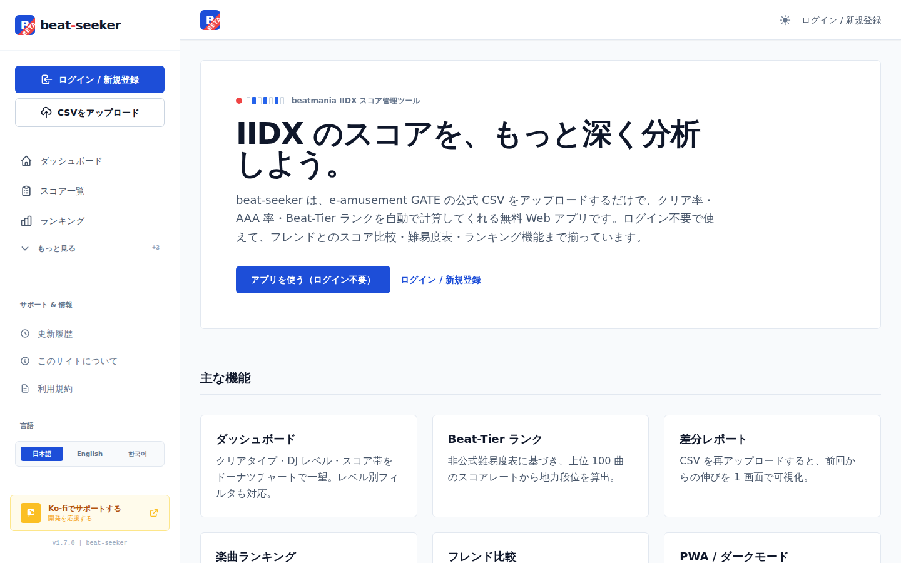
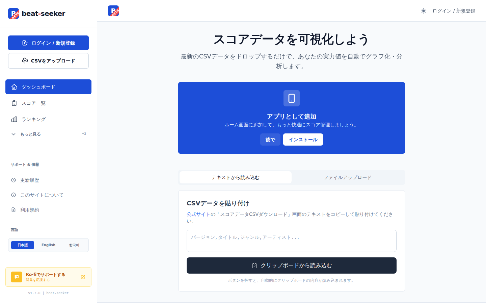
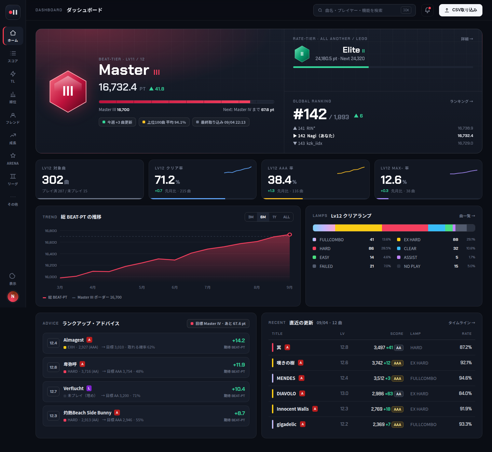
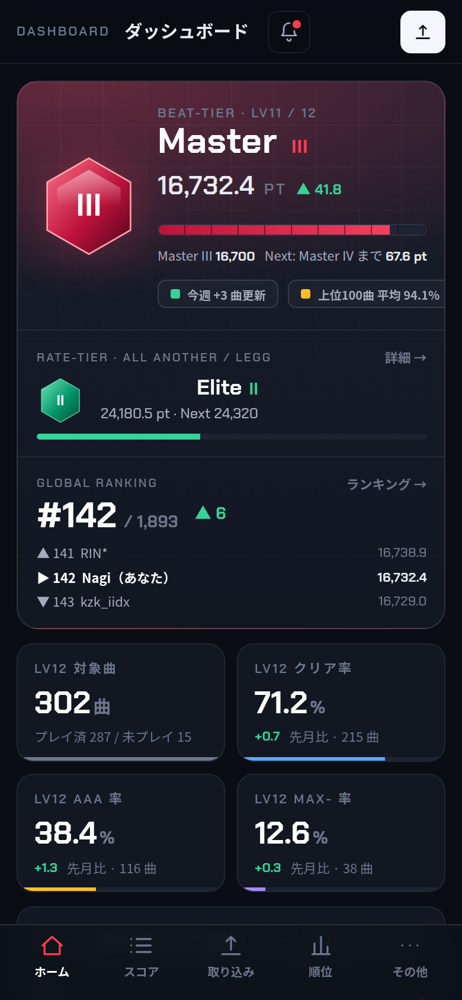
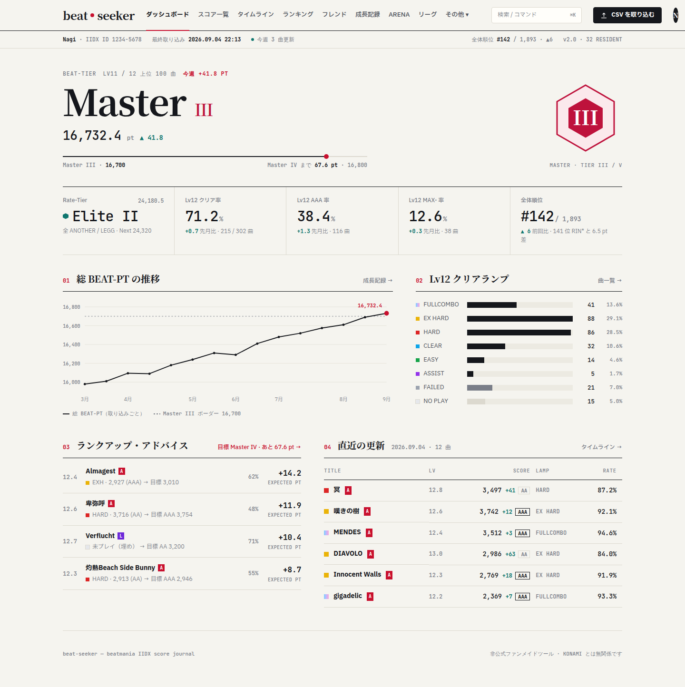
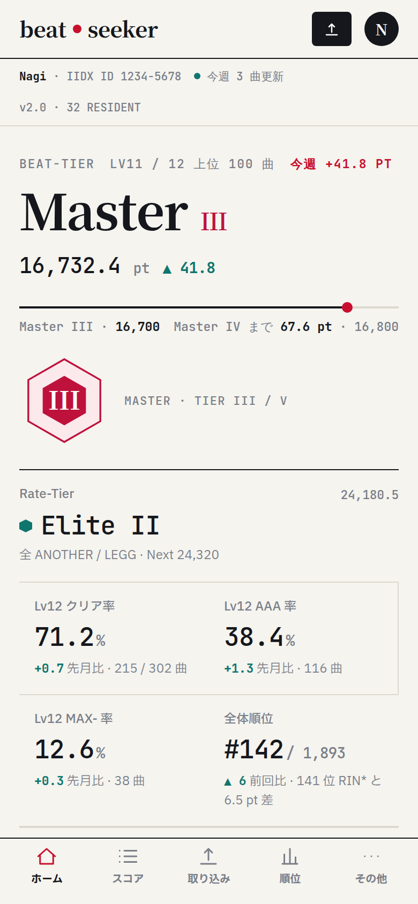
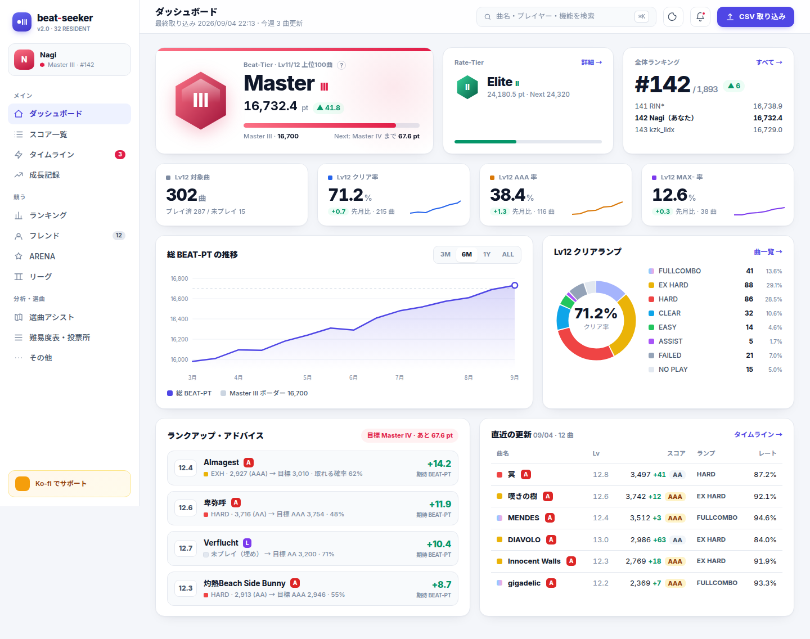
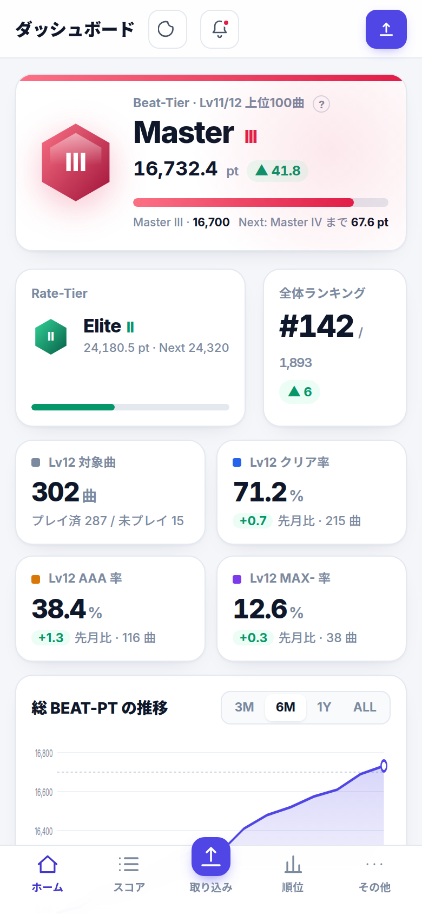

# beat-seeker デザイン刷新提案（2026-09）

現行 UI（無彩色 + blue-700 一色・1px 罫線・6px 角丸の管理画面風）を大幅に見直すための 3 方向の提案。
各案はダッシュボードを題材に HTML モックアップ（`mockups/`）を作成し、スクリーンショット（`screenshots/`）を添えている。
モックアップは静的 HTML で、ブラウザで直接開いて確認できる（Google Fonts を参照）。

| | 現行 |
|---|---|
| ランディング |  |
| ダッシュボード（未取り込み） |  |

## 現行デザインの課題

1. **汎用管理画面の見た目で、音ゲーのツールとしての個性がない。** blue-700 一色・白カード・slate 背景は Tailwind の既定に近く、他のスコアツールと区別がつかない。
2. **一番大事な情報（Beat-Tier）が「中央寄せの白カード」に埋もれている。** ランクアイコンはガラス質のグラデーションで、フラットな周囲と質感が噛み合っていない。
3. **左サイドバー 288px + ヘッダー 64px の二重クローム。** ヘッダーにはパンくずしか無く、画面幅の割に本文領域が狭い。モバイルはハンバーガー一択で、ゲーセンで片手操作する用途に合っていない。
4. **数字の書体設計がない。** スコア・pt・% が本文と同じ書体・同じ太さで並び、視線が止まる場所が作れていない。
5. **機能が増えて「もっと見る」に押し込まれている。** サイドバーの情報設計が機能追加に追いついていない。

## 全案に共通する構造変更

- **モバイルは下タブバー**（ホーム / スコア / 取り込み / 順位 / その他）。ハンバーガーは廃止し、取り込みを常に 1 タップ目に置く。
- **ヘッダーに「役割」を持たせる。** 検索・コマンドパレット（⌘K）、CSV 取り込み、通知をヘッダーに集約し、サイドバーは純粋なナビゲーションにする。
- **数字専用の書体**（tabular-nums）を導入し、pt・スコア・% の桁を揃える。
- **ティア色をシステム化する。** Beat-Tier の色（Master = ローズ等）を「その人のアクセント色」として hero・アバター・進捗バーに一貫して流す。
- **クリアランプの色を IIDX の慣習に揃える**（FC = 虹 / EXH = 黄 / HARD = 赤 / CLEAR = 水色 / EASY = 緑 / ASSIST = 紫 / FAILED = 灰）。一覧・アドバイス・分布グラフのすべてで同じ色を使う。
- **ダッシュボードの情報の順番を固定する。** ① 今のティアと次のティアまでの距離 → ② Lv12 の 4 指標 → ③ 推移とランプ分布 → ④ 次にやるべき曲 → ⑤ 直近の更新。

## 案 A「STAGE」— 筐体・リザルト画面（推奨）

- **コンセプト**: ダークファーストの「リザルト画面」。プレイ直後に見たいものを、ゲーム筐体の光の中で見せる。
- **色**: 背景 `#0a0d14` / 面 `#121722` / 罫線は白 7%。彩度のある色はティア色（hero のグロー）とランプ色だけ。ブランドの赤 `#ff3b4e` はスクラッチのモチーフとしてアクティブ表示に極少量。
- **書体**: 本文 Noto Sans JP、数字・ラベル Chakra Petch（大文字 + 字間で「計器」のニュアンス）。
- **レイアウト**: 左は 76px のアイコンレール。hero は左に紋章 + 巨大な pt、右に Rate-Tier と全体順位の 2 段。KPI は下辺にメーター線を持つ 4 タイル。
- **向く理由**: 「大幅に見直す」要望に対して最も印象が変わる。ダークモード利用率の高いプレイヤー層と噛み合う。ランクアイコンのグロー表現が周囲と自然に馴染む。
- **注意点**: ライトテーマも用意する必要がある（同じトークン構造で `--bg` を明側へ振るだけで成立する設計にしてある）。長い表の可読性は罫線とゼブラを控えめに足して担保する。

## 案 B「JOURNAL」— スコア帳・編集誌面

- **コンセプト**: 「自分のスコアを記録し続ける帳面」。紙・罫線・明朝の見出し。カードを使わず罫線だけで面を切る。
- **色**: 紙 `#f5f4ef` / 墨 `#15171c` / 罫線 `#dcd9cf`。アクセントは深紅 `#c8102e` 一色（アクティブ・強調・最新点）。ティア色は紋章にだけ。
- **書体**: 見出し Noto Serif JP、本文 IBM Plex Sans JP、数字 JetBrains Mono。
- **レイアウト**: サイドバーを廃止し、上部マストヘッド + 水平ナビ + 「ステータス行」。本文は最大 1240px 中央揃え。指標は縦罫線で区切った 1 行。章に番号（01〜04）。
- **向く理由**: 日中・屋外・スマホでの読みやすさが最も高い。表が主役になる「スコア一覧」「ランキング」「難易度表」と相性が良い。
- **注意点**: ゲーム感は最も薄い。ダークテーマは「黒い紙」として設計し直す必要がある。水平ナビは項目が増えると破綻するので、「その他▾」の設計が要る。

## 案 C「CONSOLE」— 現行の延長で密度と階層を整える

- **コンセプト**: 現行の Tailwind 資産を活かした「評価版からプロダクトへ」。カード・影・角丸を使うが、役割に応じて強弱を付ける。
- **色**: 背景 `#f4f6fa` / 面 白 / ブランドをインディゴ `#4f46e5` に寄せ、機能色（青・琥珀・紫・緑）は KPI にだけ使う。ティア色は hero カードの上辺グラデーションとして流す。
- **書体**: Inter + Noto Sans JP。
- **レイアウト**: サイドバー 248px をグループ見出し（メイン / 競う / 分析・選曲）で再編。ヘッダーに検索・取り込み・通知。hero は 3 カード横並び。ランプ分布はドーナツ。
- **向く理由**: 移行コストが最も低い（`style.css` のトークンとレイアウトの調整が中心）。ライト/ダーク両対応が現行のまま引き継げる。
- **注意点**: 「大幅な見直し」と言うには印象の変化が小さい。SaaS ダッシュボードの既視感は残る。

## 比較

| 観点 | A STAGE | B JOURNAL | C CONSOLE |
|---|---|---|---|
| 印象の変化 | ◎ | ◎ | ○ |
| 音ゲーらしさ | ◎ | △ | ○ |
| 表・長文の可読性 | ○ | ◎ | ○ |
| モバイル片手操作 | ◎（下タブ + 大きい数字） | ○ | ◎ |
| ライト/ダーク両対応 | ダーク主・ライト要設計 | ライト主・ダーク要設計 | 両方そのまま |
| 実装コスト | 中〜大 | 中 | 小〜中 |
| 既存 RankIcon との相性 | ◎ | △（フラット化が必要） | ○ |

## 推奨と進め方

**案 A を軸に、表の可読性は案 B の作法（罫線・tabular 数字・余白）を取り込む。**

1. `frontend/src/style.css` にトークン層（色・字体・角丸・罫線）を追加し、ライト/ダークをトークンの差し替えだけで切り替えられるようにする。
2. `Sidebar.vue` をアイコンレール + モバイル下タブバーへ置換。ヘッダー（`App.vue`）に検索・取り込み・通知を移す。
3. `ScoreDashboard.vue` の hero・KPI をモックアップの構造に組み替える。`RankIcon.vue` はそのまま流用。
4. `ScoreSummary.vue` の表・グラフのランプ色を共通トークンに揃える。
5. ランディング（`Landing.vue`）と共有画像（`ShareView.vue`）を新デザインで作り直す。

ファイル:

- `mockups/A_stage.html` / `B_journal.html` / `C_console.html` — 各案のダッシュボードモックアップ（1440px と 390px で確認済み）
- `screenshots/*.png` — 上記のスクリーンショット
