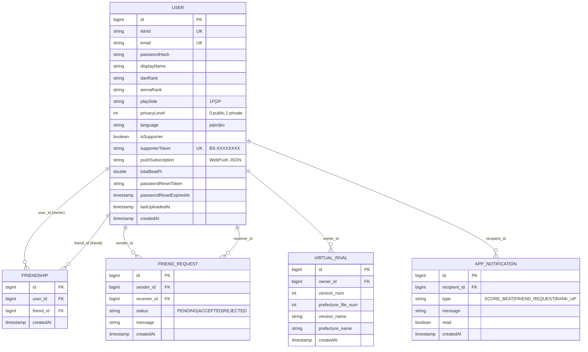
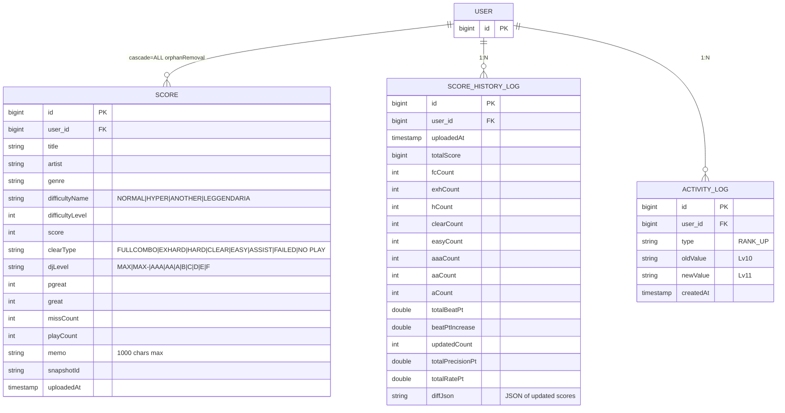
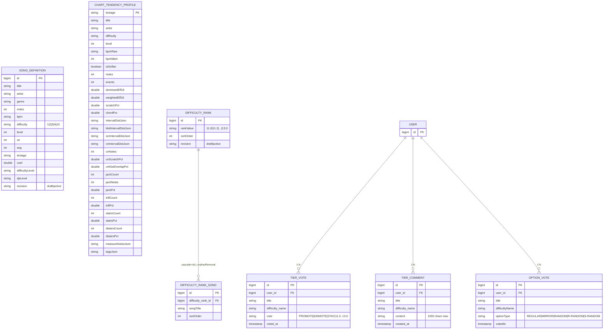
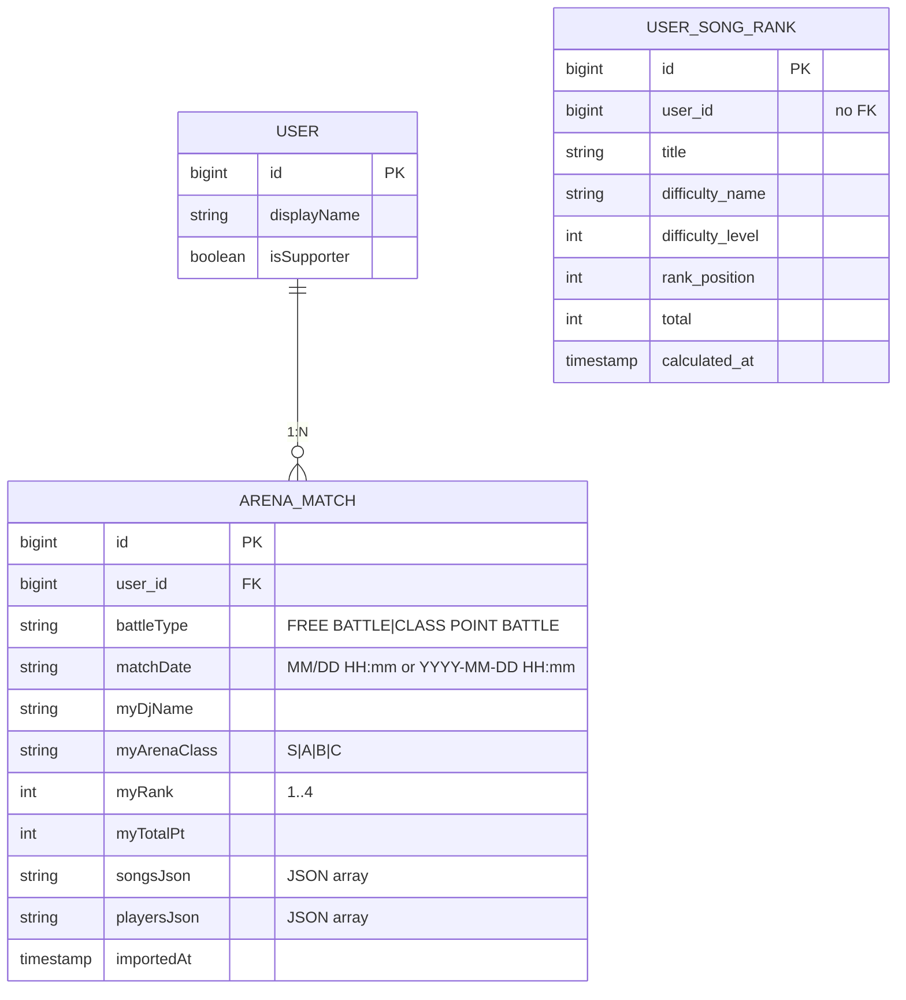

# beat-seeker 完全設計書（One-Doc Spec）

| 項目 | 内容 |
|------|------|
| プロジェクト名 | beat-seeker |
| 概要 | beatmania IIDX スコア管理・スキル可視化 Web アプリ |
| 作成日 | 2026-04-22 |
| 版 | 1.0（完全版） |
| 関連 | [基本設計書.md](./基本設計書.md)・[詳細設計書.md](./詳細設計書.md) |

この文書は、実装コードを読まずとも機能・構造・データ・ロジックの全体像を把握できるよう設計された単一設計書です。実装ソースへのリンク付きで、追跡可能性を担保しています。

---

## 目次

1. [プロジェクト全体像](#1-プロジェクト全体像)
2. [技術スタックと依存一覧](#2-技術スタックと依存一覧)
3. [環境変数と設定ファイル](#3-環境変数と設定ファイル)
4. [ディレクトリ構成（全ファイルマップ）](#4-ディレクトリ構成全ファイルマップ)
5. [データモデル（ER図＋物理定義＋全カラム）](#5-データモデルer図物理定義全カラム)
6. [バックエンド完全仕様](#6-バックエンド完全仕様)
7. [API エンドポイント完全一覧](#7-api-エンドポイント完全一覧)
8. [認証・認可・セキュリティ](#8-認証認可セキュリティ)
9. [BEAT-Tier / Rate-Tier / Folder-Rank 計算ロジック](#9-beat-tier--rate-tier--folder-rank-計算ロジック)
10. [スコアアップロード／差分計算の詳細シーケンス](#10-スコアアップロード差分計算の詳細シーケンス)
11. [非同期・スケジュール処理](#11-非同期スケジュール処理)
12. [外部連携（SMTP / Web Push / Ko-fi）](#12-外部連携smtp--web-push--ko-fi)
13. [フロントエンド完全仕様](#13-フロントエンド完全仕様)
14. [画面一覧と画面遷移](#14-画面一覧と画面遷移)
15. [Composable / Util 完全リファレンス](#15-composable--util-完全リファレンス)
16. [CSV / ブックマークレット入出力仕様](#16-csv--ブックマークレット入出力仕様)
17. [国際化（i18n）キー体系](#17-国際化i18nキー体系)
18. [PWA / Service Worker](#18-pwa--service-worker)
19. [エラー設計と運用上の注意](#19-エラー設計と運用上の注意)
20. [デプロイ・開発運用](#20-デプロイ開発運用)
21. [既知の要改善点 / ToDo](#21-既知の要改善点--todo)
22. [用語集](#22-用語集)

---

## 1. プロジェクト全体像

### 1.1 目的と価値

`beatmania IIDX` のスコア（eagate CSV / ARENA バトル）を集約し、**独自の BEAT-PT / Rate-PT / Precision-PT** でスキルを可視化する SPA。フレンド・ランキング・難易度表投票・譜面傾向分析・スコア予測・スキルツリーまでをワンストップで提供する。

### 1.2 ユースケース

| ペルソナ | 代表的利用シナリオ |
|----------|-------------------|
| 一般プレイヤー | CSV / ブックマークレットでスコアを取り込み、BEAT-Tier を確認、フレンドと比較 |
| 上位帯プレイヤー | 全体ランキング・曲別ランキングで立ち位置を把握、譜面分析で弱点曲を発見 |
| 管理者 (userId=18) | 楽曲・非公式難易度表のドラフト編集／本番適用、全ユーザー再計算 |
| サポーター | Ko-fi 支援でサポーター枠表示を有効化 |

### 1.3 アーキテクチャ図

```
┌─────────────────────────────────────────┐
│ Browser (PWA SPA)                       │
│   Vue 3 + Vue Router 5 + TypeScript     │
│   Vite (dev) / nginx (prod)             │
│   Service Worker (Push受信)             │
└──────────┬──────────────────────────────┘
           │ HTTPS / JSON / Bearer JWT
┌──────────▼──────────────────────────────┐
│ Application Server                      │
│   Spring Boot 3.3.0 / Java 17           │
│   Spring Security (JWT filter)          │
│   JPA / Hibernate 6                     │
│   @EnableAsync / @EnableScheduling      │
└──────────┬──────────────────────────────┘
           │ JDBC (HikariCP 10)
┌──────────▼──────────────────────────────┐
│ PostgreSQL 15 (prod) / H2 (dev, option) │
└─────────────────────────────────────────┘

External:
  - Gmail SMTP  (パスワードリセット／管理者通知)
  - Web Push    (VAPID, フレンド通知)
  - Ko-fi API   (Webhook, サポーター認証)
  - chart_cache (譜面傾向データ／ローカルファイル)
  - Textage     (譜面確認リンク、外部参照のみ)
```

---

## 2. 技術スタックと依存一覧

### 2.1 Backend（`backend/pom.xml`）

| 依存 | バージョン | 用途 |
|------|-----------|------|
| `spring-boot-starter-parent` | 3.3.0 | BOM |
| `spring-boot-starter-data-jpa` |  | ORM／リポジトリ |
| `spring-boot-starter-web` |  | REST API |
| `spring-boot-starter-validation` |  | Bean Validation |
| `spring-boot-starter-security` |  | セキュリティ |
| `spring-boot-starter-oauth2-client` |  | 将来の OAuth 用（現状未使用） |
| `spring-boot-starter-mail` |  | Gmail SMTP 送信 |
| `postgresql` | runtime | 本番 DB ドライバ |
| `h2` | runtime | 開発／テスト DB |
| `lombok` | optional | Getter/Setter 自動生成 |
| `io.jsonwebtoken:jjwt-api/impl/jackson` | 0.12.6 | JWT |
| `nl.martijndwars:web-push` | 5.1.1 | Web Push |
| `jakarta.annotation-api` | 3.0.0 |  |
| `org.bouncycastle:bcprov-jdk18on` | 1.78 | Web Push の署名用 |

ビルド: `spring-boot-maven-plugin` で `*.jar` を生成。Lombok はアーティファクトから除外。

### 2.2 Frontend（`frontend/package.json`）

| 依存 | バージョン | 用途 |
|------|-----------|------|
| `vue` | ^3.5.12 | フレームワーク |
| `vue-router` | ^5.0.4 | SPA ルーティング |
| `chart.js` | ^4.5.1 | グラフ |
| `vue-chartjs` | ^5.3.3 | Vue バインディング |
| `papaparse` | ^5.5.3 | CSV パース |
| `html2canvas` | ^1.4.1 | スクリーンショット（シェア） |
| `iconv-lite` | ^0.7.2 | 文字コード変換（Shift_JIS CSV） |

dev:
| 依存 | バージョン |
|------|-----------|
| `vite` | ^5.4.10 |
| `@vitejs/plugin-vue` | ^5.1.4 |
| `typescript` | ~5.6.2 |
| `tailwindcss` | ^3.4.14 |
| `postcss` | ^8.4.47 |
| `autoprefixer` | ^10.4.20 |
| `vue-tsc` | ^2.1.8 |
| `@types/papaparse` | ^5.5.2 |

スクリプト: `dev=vite` / `build=vite build && node scripts/prerender.mjs` / `preview=vite preview`

---

## 3. 環境変数と設定ファイル

### 3.1 application.yml（`backend/src/main/resources/application.yml`）

```yaml
spring:
  application:
    name: beat-seeker-backend
  mail:
    host: smtp.gmail.com
    port: 587
    username: ${GMAIL_USERNAME:}
    password: ${GMAIL_APP_PASSWORD:}
    properties:
      mail:
        smtp:
          auth: true
          starttls:
            enable: true
  datasource:
    url: ${SPRING_DATASOURCE_URL:jdbc:postgresql://.../beatseeker}
    driver-class-name: org.postgresql.Driver
    username: ${SPRING_DATASOURCE_USERNAME:...}
    password: ${SPRING_DATASOURCE_PASSWORD:...}
    hikari:
      connection-timeout: 30000
      maximum-pool-size: 10
      initialization-fail-timeout: -1
      connection-init-sql: SET statement_timeout = '30s'
  jpa:
    hibernate:
      ddl-auto: update
    properties:
      hibernate:
        dialect: org.hibernate.dialect.PostgreSQLDialect
        jdbc:
          batch_size: 100
        order_inserts: true
        order_updates: true
  servlet:
    multipart:
      max-file-size: 50MB
      max-request-size: 50MB
server:
  port: 8080
logging:
  level:
    org.springframework.web: DEBUG
    org.springframework.security: DEBUG
app:
  frontend-url: ${FRONTEND_URL:http://localhost:5173}
vapid:
  public:  { key: <VAPID_PUBLIC_KEY> }
  private: { key: <VAPID_PRIVATE_KEY> }
  subject: mailto:admin@example.com
kofi:
  verification:
    token: ${KOFI_VERIFICATION_TOKEN:}
```

### 3.2 環境変数完全リスト

| 変数 | 既定値 | 用途 |
|------|--------|------|
| `FRONTEND_URL` | `http://localhost:5173` | CORS 許可オリジン／パスワード再設定リンク |
| `SPRING_DATASOURCE_URL` | Render Postgres URL | DB 接続 |
| `SPRING_DATASOURCE_USERNAME` | (埋め込み) | DB ユーザー |
| `SPRING_DATASOURCE_PASSWORD` | (埋め込み) | DB パスワード |
| `GMAIL_USERNAME` | (空) | Gmail SMTP 送信元 |
| `GMAIL_APP_PASSWORD` | (空) | Gmail アプリパスワード |
| `KOFI_VERIFICATION_TOKEN` | (空) | Ko-fi Webhook 検証 |
| `jwt.secret` | `beatseeker-default-secret-key-...!!` | JWT 署名鍵（**本番で必ず上書き**） |
| `jwt.expiration-ms` | `604800000`（7 日） | JWT 有効期限 |
| `VITE_API_BASE`（フロント） | `http://localhost:8080` | API ベース URL（ビルド時埋め込み） |

### 3.3 Vite 設定（`frontend/vite.config.ts`）

```ts
const buildVersion = Date.now().toString()
export default defineConfig({
  define: { __APP_VERSION__: JSON.stringify(buildVersion) },
  plugins: [
    vue(),
    {
      name: 'generate-version-json',
      buildStart() {
        writeFileSync('public/version.json', JSON.stringify({ version: buildVersion }))
      }
    }
  ],
  server: { proxy: { '/api': { target: 'http://localhost:8080', changeOrigin: true } } }
})
```

### 3.4 nginx 設定（`frontend/nginx.conf`）

```nginx
server {
  listen 80;
  root /usr/share/nginx/html;
  index index.html;
  location / { try_files $uri $uri/ /index.html; }  # SPAフォールバック
  location ~* \.(js|css|png|svg|ico|woff2?)$ {
    expires 1y;
    add_header Cache-Control "public, immutable";
  }
}
```

### 3.5 Docker

- **backend/Dockerfile**: `maven:3.9.6-eclipse-temurin-17` で build → `eclipse-temurin:17-jre` で起動（EXPOSE 8080）
- **frontend/Dockerfile**: `node:20-alpine` で build → `nginx:stable-alpine` で配信（EXPOSE 80）
- **docker-compose.yml**: `db`（postgres:15-alpine, port 5432）＋ `backend`（8080）＋ `frontend`（80）

---

## 4. ディレクトリ構成（全ファイルマップ）

### 4.1 トップレベル

```
beat-seeker/
├── README.md                          Spring Boot + Vite の起動手順
├── docker-compose.yml                 3 サービス構成
├── backend/                           Spring Boot アプリ
├── frontend/                          Vite + Vue 3 アプリ
├── chart_cache/                       譜面傾向分析 JSON（ローカルキャッシュ）
├── scripts/                           運用補助スクリプト
└── docs/                              本設計書一式
```
(補助ツール・検証用 `*.py`, `*.js`, `*.txt` はリポジトリ直下に多数存在。これらは運用支援用で、プロダクションには含まれない)

### 4.2 Backend 内訳（コメント付き）

| ファイル | 行数 | 役割 |
|----------|------|------|
| `BackendApplication.java` | 18 | `@SpringBootApplication + @EnableAsync + @EnableScheduling` |
| `DataInitializer.java` | 62 | 起動時に言語・Rate-Tier フラグを補完、song/difficulty を seed |
| `TestController.java` | — | ヘルスチェック（開発用） |
| `config/SecurityConfig.java` | 116 | CORS / エンドポイント認可 / JWT filter 挿入 |
| `config/JwtAuthFilter.java` | 43 | Bearer → SecurityContext 登録 |
| `config/JwtUtil.java` | 52 | HS256 署名・検証 |
| `controller/AuthController.java` | 254 | 登録／ログイン／me／me/profile／forgot-password／reset-password |
| `controller/UserController.java` | 170 | `/api/users/{id}` 公開プロフィール・スコア・履歴・friend-status |
| `controller/ScoreController.java` | 848 | スコアアップロード／履歴ログ保存／各ランキング／曲別順位 |
| `controller/ArenaController.java` | 213 | ARENA バトル JSON インポート・一覧・削除 |
| `controller/FriendController.java` | 442 | フレンド CRUD・申請・通知購読 |
| `controller/NotificationController.java` | 61 | アプリ内通知一覧・一括既読 |
| `controller/AdminController.java` | 313 | 管理者用一覧・再計算・マイグレーション |
| `controller/GameDataController.java` | 143 | 曲・難易度表（公開／ドラフト／適用） |
| `controller/ChartTendencyController.java` | 284 | 傾向プロファイル・予測・スキルツリー・類似度 |
| `controller/TierVoteController.java` | 148 | 難易度表投票 |
| `controller/TierCommentController.java` | 134 | 難易度表コメント |
| `controller/OptionVoteController.java` | 174 | オプション投票（1P 基準正規化） |
| `controller/ActivityController.java` | 44 | 公開アクティビティフィード |
| `controller/KofiWebhookController.java` | 101 | Ko-fi Webhook でサポーター化 |
| `controller/{Login,Register,ProfileUpdate,SaveHistoryLog,RecalculatePoints}Request.java` | 6〜16 | DTO（record） |
| `entity/User.java` | 75 | ユーザー |
| `entity/Score.java` | 45 | スコア |
| `entity/ScoreHistoryLog.java` | 44 | 履歴ログ |
| `entity/SongDefinition.java` | 55 | 曲×難易度マスタ |
| `entity/DifficultyRank.java` | 34 | 難易度表ランク |
| `entity/DifficultyRankSong.java` | 27 | ランク内の曲 |
| `entity/UserSongRank.java` | 61 | 順位キャッシュ |
| `entity/ChartTendencyProfile.java` | 133 | 譜面傾向 |
| `entity/Friendship.java` | 31 | 双方向 2 レコード |
| `entity/FriendRequest.java` | 35 | 申請（PENDING/ACCEPTED/REJECTED） |
| `entity/AppNotification.java` | 35 | アプリ内通知 |
| `entity/ActivityLog.java` | 37 | ランクアップ等 |
| `entity/ArenaMatch.java` | 37 | ARENA バトル履歴 |
| `entity/TierVote.java` | 49 | 難易度表投票 |
| `entity/TierComment.java` | 46 | 難易度表コメント |
| `entity/OptionVote.java` | 36 | オプション投票 |
| `entity/VirtualRival.java` | 39 | 仮想ライバル（将来拡張） |
| `repository/*.java` | 15 ファイル | `@Query` / Derived Query メソッド多数 |
| `service/GameDataService.java` | 341 | 曲／難易度表 CRUD・ドラフト適用 |
| `service/ScoreRecalculationService.java` | 413 | 全ユーザー再計算・Rate-PT 補正 |
| `service/ChartTendencyService.java` | 1082 | 傾向プロファイル・類似度・予測・スキルツリーデータ生成 |
| `service/SkillTreeService.java` | 323 | スキルツリー構造化 |
| `service/TopRankersBeatPtService.java` | 389 | トップランカー外部データ取扱い |
| `service/EmailService.java` | 201 | メール送信 |
| `service/PushNotificationService.java` | 62 | Web Push |
| `service/SongRankBatchService.java` | 41 | 日次順位バッチ |
| `resources/application.yml` | 68 | 設定 |
| `resources/data/song_data.json` |  | 曲 seed |
| `resources/data/difficulty_table.json` |  | 難易度表 seed |
| `resources/top-rankers-data/` |  | トップランカー初期データ |

### 4.3 Frontend 内訳

```
src/
├── main.ts                  createApp→router→mount('#app')
├── App.vue                  グローバルレイアウト・状態注入・モーダル統括
├── router/index.ts          14ルート定義
├── views/                   19 画面コンポーネント
├── components/              35 共通コンポーネント
├── composables/             13 Composable + constants.ts
├── utils/
│   ├── beatTier.ts          BEAT/Rate/Folder ティア計算
│   ├── csvParser.ts         Shift_JIS CSV → ScoreData[]
│   ├── scoreData.ts         ScoreData → ScoreRecord（フラット化＋計算）
│   └── bookmarklet.ts       eagate で実行するIIFEコード
├── types/
│   ├── ScoreData.ts         入力型
│   └── UploadDiff.ts        アップロード差分型
├── locales/
│   ├── index.ts             翻訳辞書の集約・型
│   ├── ja.ts / en.ts / ko.ts
├── data/
│   ├── song_data.json       フロント側初期フォールバック
│   └── difficulty_table.json
├── style.css / output.css / aprilFools.css
└── vite-env.d.ts
```

public/:
- `favicon.svg`, `manifest.json`（PWA）、`sw.js`（Service Worker）
- `version.json`（ビルドごとにスタンプ更新、`useAppUpdate` が参照）
- `sample_scores.csv`, `robots.txt`, `sitemap.xml`, `_headers`（Netlify/Render ヘッダー）

---

## 5. データモデル（ER図＋物理定義＋全カラム）

### 5.1 ER 図（Mermaid 風テキスト）

```
users 1 ─── * scores
users 1 ─── * score_history_logs
users 1 ─── * friendships (user_id)    ⇐ 1関係につき2行
users 1 ─── * friendships (friend_id)
users 1 ─── * friend_requests (sender_id)
users 1 ─── * friend_requests (receiver_id)
users 1 ─── * app_notifications
users 1 ─── * activity_logs
users 1 ─── * arena_matches
users 1 ─── * option_votes
users * ─── * tier_votes           (user_id)
users * ─── * tier_comments        (user_id)
users * ─── * user_song_ranks      (user_id)  ⇐ バッチで洗い替え

song_definitions                    (title × difficulty × revision で同一曲の複数行)
difficulty_ranks 1 ─── * difficulty_rank_songs
chart_tendency_profiles             (textage PK)
```

### 5.2 全テーブル物理定義

#### users（`entity/User.java`）

| カラム | 型 | 制約／既定値 | 備考 |
|--------|-----|-------------|------|
| id | BIGSERIAL | PK | |
| iidx_id | VARCHAR(9) | NOT NULL / UNIQUE | `NNNN-NNNN` |
| password_hash | VARCHAR | NOT NULL | BCrypt |
| display_name | VARCHAR |  | 未登録時 `"No Name"` |
| dan_rank | VARCHAR(20) |  | 段位 |
| arena_rank | VARCHAR(10) |  | `A1`〜`A10` 等 |
| play_side | VARCHAR(2) | default `'1P'` | `1P` / `2P` |
| privacy_level | INTEGER | default `1` | 0/1/2 |
| language | VARCHAR(5) | default `'ja'` | `ja`/`en`/`ko` |
| show_rate_tier | BOOLEAN | default `TRUE` | |
| is_supporter | BOOLEAN | default `FALSE` | |
| show_supporter_border | BOOLEAN | default `TRUE` | |
| supporter_token | VARCHAR(12) | UNIQUE | `BS-XXXXXXXX` 自動生成 |
| last_uploaded_at | TIMESTAMP |  | |
| total_beat_pt | DOUBLE | default `0` | 最新 BEAT-PT キャッシュ |
| push_subscription | TEXT |  | `{endpoint, keys:{p256dh,auth}}` |
| email | VARCHAR | UNIQUE | 小文字正規化 |
| password_reset_token | VARCHAR |  | UUID |
| password_reset_expired_at | TIMESTAMP |  | 1 時間有効 |
| created_at | TIMESTAMP | NOT NULL, IMMUTABLE | `@CreationTimestamp` |

#### scores（`entity/Score.java`）

| カラム | 型 | 備考 |
|--------|-----|------|
| id | BIGSERIAL PK | |
| user_id | BIGINT FK(users) LAZY | |
| title, artist, genre | VARCHAR | |
| difficulty_name | VARCHAR | `BEGINNER` / `NORMAL` / `HYPER` / `ANOTHER` / `LEGGENDARIA` |
| difficulty_level | INTEGER | 公式 Lv |
| score | INTEGER | 0 〜 `notes * 2` |
| clear_type | VARCHAR | `FULLCOMBO CLEAR`/`EX HARD CLEAR`/`HARD CLEAR`/`CLEAR`/`EASY CLEAR`/`ASSIST CLEAR`/`FAILED`/`NO PLAY`/`---` |
| dj_level | VARCHAR | `AAA`〜`F` / `---` |
| pgreat, great | INTEGER | |
| miss_count | INTEGER | nullable（未計測） |
| play_count | INTEGER | |
| memo | TEXT | |
| snapshot_id | VARCHAR | アップロード単位識別子 |
| uploaded_at | TIMESTAMP | NOT NULL |

**UNIQUE (user_id, title, difficulty_name, difficulty_level)**

#### score_history_logs（`entity/ScoreHistoryLog.java`）

| カラム | 型 | 備考 |
|--------|-----|------|
| id | BIGSERIAL | |
| user_id | BIGINT | |
| uploaded_at | TIMESTAMP NOT NULL | |
| total_score | BIGINT default 0 | |
| fc_count, exh_count, h_count, clear_count, easy_count | INTEGER | クリアタイプ別 |
| aaa_count, aa_count, a_count | INTEGER | DJ LEVEL 別 |
| total_beat_pt | DOUBLE | |
| beat_pt_increase | DOUBLE | |
| updated_count | INTEGER | |
| total_precision_pt | DOUBLE | |
| total_rate_pt | DOUBLE | |
| diff_json | TEXT | 差分曲 JSON 配列 |

#### song_definitions（`entity/SongDefinition.java`）

| カラム | 型 | 備考 |
|--------|-----|------|
| id | BIGSERIAL | |
| title, artist, genre | VARCHAR | |
| difficulty | VARCHAR | `1`=BEGINNER, `2`=NORMAL, `3`=HYPER, `4`=ANOTHER, `10`=LEGGENDARIA |
| level | INTEGER | 公式 Lv |
| notes | INTEGER | `maxScore = notes * 2` |
| bpm | VARCHAR | |
| wr, avg | INTEGER | ワールドレコード／平均 |
| textage | VARCHAR | Textage URL フラグメント |
| coef | DOUBLE | 任意係数 |
| difficulty_level | VARCHAR | 非公式難易度表ランク名 |
| dp_level | VARCHAR | DP 段位 |
| revision | VARCHAR | `active` / `draft` |

#### difficulty_ranks（`entity/DifficultyRank.java`）

| カラム | 型 | 備考 |
|--------|-----|------|
| id | BIGSERIAL | |
| rank_value | VARCHAR | 例 `12.5`、`Uncategorized` |
| sort_order | INTEGER | |
| revision | VARCHAR | `active` / `draft` |
| （songs） | `@OneToMany(cascade=ALL, orphanRemoval=true, fetch=EAGER, @OrderBy sort_order ASC)` |

#### difficulty_rank_songs

| カラム | 型 | 備考 |
|--------|-----|------|
| id | BIGSERIAL | |
| difficulty_rank_id | BIGINT FK | |
| song_title | VARCHAR | `[L]` サフィックスは LEGGENDARIA |
| sort_order | INTEGER | |

#### user_song_ranks

| カラム | 型 | 備考 |
|--------|-----|------|
| id | BIGSERIAL | |
| user_id | BIGINT | INDEX |
| title, difficulty_name, difficulty_level | | |
| rank, total | INTEGER NOT NULL | |
| calculated_at | TIMESTAMP | |

#### chart_tendency_profiles

| カラム | 型 | 備考 |
|--------|-----|------|
| textage | VARCHAR PK | 例 `22/chrono_p.html?1AC00` |
| title, artist | VARCHAR | |
| difficulty, level | VARCHAR / INTEGER | |
| bpm_raw, bpm_main | VARCHAR | |
| is_soflan | BOOLEAN | |
| notes, events | INTEGER | |
| dominant_eff16, weighted_eff16 | DOUBLE | 効率指標 |
| scratch_pct, chord_pct, single_pct, ranuchi | DOUBLE | 配置比率 |
| tags_json | TEXT | タグ配列 JSON |
| interval_dist_json, cn_interval_dist_json, kbd_interval_dist_json, scr_interval_dist_json | TEXT | インターバル分布 |
| cn_notes, cn_scratch_pct, cn_kbd_overlap_pct | 数値 | CN 属性 |
| jack_count, jack_notes, jack_pct | 配置パターン | |
| trill_count, trill_notes, trill_pct | 配置パターン | |
| stairs_count, stairs_notes, stairs_pct | 配置パターン | |
| dstairs_count, dstairs_notes, dstairs_pct | 配置パターン | |
| measure_notes_json, measure_notes_kbd_json, measure_notes_scr_json | TEXT | 小節別分布 |

#### friendships / friend_requests

friendships: `id BIGSERIAL`, `user_id`, `friend_id`, `created_at`, **UNIQUE(user_id, friend_id)**。双方向は 2 レコード。

friend_requests: `id`, `sender_id`, `receiver_id`, `status VARCHAR(20) default 'PENDING'`, `message VARCHAR(255)`, `created_at`。

#### app_notifications / activity_logs / arena_matches

- app_notifications: `id`, `recipient_id`, `type VARCHAR(30)`（`SCORE_BEAT`/`FRIEND_RANK_UP`/`FRIEND_REQUEST`）, `message TEXT`, `read BOOLEAN default FALSE`, `created_at`
- activity_logs: `id`, `user_id`, `type VARCHAR(30)`（例 `RANK_UP`）, `old_value VARCHAR(50)`, `new_value VARCHAR(50)`, `created_at`
- arena_matches: `id`, `user_id`, `battle_type`, `match_date VARCHAR`（例 `"2026-03-15 17:10"`）, `my_dj_name`, `my_arena_class`, `my_rank INTEGER`, `my_total_pt INTEGER`, `songs_json TEXT`, `players_json TEXT`, `imported_at TIMESTAMP default NOW()`

#### tier_votes / tier_comments / option_votes

- tier_votes: UNIQUE(user_id, title, difficulty_name)。`vote` は `PROMOTE` / `DEMOTE` / `STAY` または `11.0`〜`13.0` の段位値
- tier_comments: `content VARCHAR(1000)` NOT NULL
- option_votes: UNIQUE(user_id, title, difficulty_name)。`option_type`=`REGULAR`/`MIRROR`/`RANDOM`/`R-RANDOM`/`S-RANDOM`（**保存は 1P 基準正規化**）

#### virtual_rivals（将来拡張）

`entity/VirtualRival.java`（39 行）は仮想ライバルの定義。現フェーズでは限定利用。

### 5.3 インデックス戦略

| テーブル | インデックス | 根拠 |
|----------|--------------|------|
| users | UNIQUE(iidx_id), UNIQUE(email), UNIQUE(supporter_token) | ログイン／パスワードリセット／Ko-fi |
| scores | UNIQUE(user_id, title, difficulty_name, difficulty_level) | UPSERT・被抜き検出 |
| score_history_logs | 推奨 (user_id, uploaded_at DESC) | グラフ／DISTINCT ON 抽出 |
| user_song_ranks | idx_user_song_ranks_user_id | 認証ユーザー向け高速引き |
| friendships | UNIQUE(user_id, friend_id) | 重複フレンド防止 |
| tier_votes | UNIQUE(user_id, title, difficulty_name) | 投票上書き |
| option_votes | UNIQUE(user_id, title, difficulty_name) | 投票上書き |

---

## 6. バックエンド完全仕様

### 6.1 起動エントリ

```java
// BackendApplication.java
@SpringBootApplication
@EnableAsync
@EnableScheduling
public class BackendApplication { main(args) { SpringApplication.run(...); } }
```

### 6.2 DataInitializer（`DataInitializer.java`）

- `ApplicationRunner`
- 起動時処理（`@Transactional`）:
  1. `UPDATE User u SET u.language='ja' WHERE u.language IS NULL`
  2. `UPDATE User u SET u.showRateTier=true WHERE u.showRateTier IS NULL`
  3. `classpath:data/song_data.json` があれば `gameDataService.seedSongData(json)`
  4. `classpath:data/difficulty_table.json` があれば `gameDataService.seedDifficultyTable(json)`
- 例外は `System.err` に出して継続

### 6.3 SecurityConfig（`config/SecurityConfig.java`）

- `@Configuration + @EnableWebSecurity`
- `BCryptPasswordEncoder` を Bean 登録
- `SessionCreationPolicy.STATELESS`、`csrf().disable()`
- CORS: `setAllowedOrigins(frontendUrl, "http://localhost:5173")` / Methods `GET/POST/PUT/DELETE/OPTIONS` / `allowCredentials=true`
- 認可ルール（抜粋）:
  - permitAll: `/api/game-data/**`、`/api/scores/ranking*`、`/api/scores/rate-ranking*`、`/api/scores/song-*`、`/api/scores/all-user-scores`、`/api/scores/user-tier-totals/**`、`/api/scores/debug-*`、`/api/activity/feed`、`/api/auth/forgot-password`、`/api/auth/reset-password`、`/api/users/*/profile|scores|history`、`/api/kofi/webhook`、`/api/friends/test`、`/api/test-root`
  - authenticated: `/api/users/*/friend-status`、`/api/auth/me`、`/api/auth/me/profile`、`/api/notifications/**`、`/api/admin/game-data/**`、`/api/scores/upload|save-history-log|me|history|*/memo`、`/api/scores/**`、POST/DELETE `/api/votes`、POST/DELETE `/api/tier-votes`、`/api/tier-votes/mine`、`/api/friends/**`、`/api/arena/**`
  - それ以外は `permitAll`（※ 管理者エンドポイントは controller 内で `userId == 18` チェック）
- `HttpStatusEntryPoint(UNAUTHORIZED)` を登録
- `JwtAuthFilter` を `UsernamePasswordAuthenticationFilter` の前に挿入

### 6.4 JwtUtil（`config/JwtUtil.java`）

```java
Keys.hmacShaKeyFor(secret.getBytes(UTF_8));  // HS256
generateToken(iidxId)   → subject=iidxId, iat=now, exp=now+expirationMs
getIidxIdFromToken(token) → parseSignedClaims(token).getSubject()
validateToken(token) → 例外なしで true / 例外時 false
```

### 6.5 JwtAuthFilter（`config/JwtAuthFilter.java`）

```java
if (header startsWith "Bearer ") {
  token = header.substring(7);
  if (jwtUtil.validateToken(token)) {
    iidxId = jwtUtil.getIidxIdFromToken(token);
    SecurityContext.setAuthentication(
        new UsernamePasswordAuthenticationToken(iidxId, null, emptyList()));
  }
}
filterChain.doFilter(req, res);
```

### 6.6 サービス層

#### 6.6.1 GameDataService（341 行）

主要メソッド（署名）:
```java
String getActiveSongDataJson();
String getActiveDifficultyTableJson();
List<SongDefinition> getDraftSongs();
SongDefinition addDraftSong(Map<String, Object> songForm);  // 複数難易度を一括追加
void deleteDraftSong(Long id);
String getDraftDifficultyTableJson();
void saveDraftDifficultyTable(String json);
void applyDraft();                          // revision=draft → active スワップ＋再計算非同期起動
boolean hasDraftSongs();
boolean hasDraftDifficultyTable();
void seedSongData(String json);             // 起動時seed
void seedDifficultyTable(String json);
```

#### 6.6.2 ScoreRecalculationService（413 行）

```java
@Async
CompletableFuture<Void> recalculateAllUsersAsync(String songJson, String diffJson);

double calculateRatePtFromActiveData(List<Score> scores);
void patchZeroRatePtLogs(Map<String,Integer> songMaxScores);
```
- 計算内容: 各ユーザーの全スコアに対して BEAT-PT / Rate-PT / Precision-PT を再計算し、最新の `ScoreHistoryLog` と `users.total_beat_pt` を更新
- ロジックは `frontend/src/utils/beatTier.ts` と同仕様（後述第9章）

#### 6.6.3 ChartTendencyService（1082 行）

```java
int importFromDirectory(String dir);            // chart_cache/profiles/*.json
int importFromJsonArray(JsonNode body);         // 本番用エンドポイント受口
Optional<ChartTendencyProfile> getByTextage(String textage);
List<ChartTendencyProfile> getByTextageBase(String base);
List<ChartTendencyProfile> getByLevelAndDifficulty(Integer level, String difficulty);
Map<String,Object> predictScore(User user, String textage);
Map<String,Object> predictAllScores(User user);                // {textage → {score, informalRank}}
Map<String,Object> computeSimilarityDebug(String a, String b);
```
- 予測: ユーザーの既プレイ曲の傾向ベクトルと実スコアで回帰、対象譜面のベクトルを入力して予測値を返す
- 類似度: タグ・配置パターンの重み付きコサイン類似度

#### 6.6.4 SkillTreeService（323 行）

```java
Map<String,Object> generateSkillTree(User user);   // userがnullなら未認証版
```

#### 6.6.5 TopRankersBeatPtService（389 行）

```java
List<Map<String,Object>> getRanking();
List<Map<String,Object>> getRateRanking();
List<Map<String,Object>> getSongTopRankers(String title, String diff);
Map<String,Object> getAreaProfile(int versionNum, int prefectureFileNum);
void recompute();
```

#### 6.6.6 PushNotificationService（62 行）

```java
void sendNotification(String subscriptionJson, String title, String body, String url);
void sendNotificationWithEx(...) throws GeneralSecurityException, IOException, JoseException;
```
- `nl.martijndwars.webpush.PushService` を使用し、VAPID 公開／秘密鍵で ECDSA 署名
- `Subscription` は Jackson で JSON→POJO へ
- 失敗コード `410/404` を検出した場合、呼び出し側で該当 `push_subscription` を NULL 化

#### 6.6.7 EmailService（201 行）

```java
void sendPasswordResetEmail(String email, String iidxId, String token);
void sendScoreUpdateNotification(String adminEmail, User user, int updatedCount, ...);
void sendSupporterActivatedNotification(String adminEmail, User user);
```
- `JavaMailSender` 利用、送信元 `${GMAIL_USERNAME}`
- パスワードリセットリンク: `${FRONTEND_URL}/reset-password?token=<uuid>`

#### 6.6.8 SongRankBatchService（41 行）

```java
@Async CompletableFuture<Void> recalculateAllAsync();
void recalculateAll();
```
- 全ユーザー × ANOTHER / LEGGENDARIA 曲について `RANK() OVER (PARTITION BY title,difficulty ORDER BY score DESC)` 相当を計算
- `user_song_ranks` を洗い替え

### 6.7 Repository 層の代表カスタムクエリ

#### ScoreRepository

```java
List<Score> findByUserOrderByUploadedAtAsc(User user);
List<Score> findByUserOrderByUploadedAtDesc(User user);
List<Score> findByUserAndTitlesAndDifficulties(User u, List<String> titles, List<String> diffs);

@Query(native=true)
List<Object[]> findAllUserAnotherAndLeggendariaScores();     // 全ユーザーANOTHER/LEGG

@Query(native=true)
List<Object[]> findSongRanking(String title, String diff, int maxPrivacy);  // privacy配慮

@Query(native=true)
List<Object[]> findRawSongScoresWithBeatTier(String diff);   // 曲別BEAT-TIER別平均

@Query(native=true)
List<Object[]> findSongAvgScores();
List<Object[]> findSongMaxMinusCounts();
List<Object[]> findSongAaaCounts();
List<Object[]> calculateDifficultySimulation();

List<Object[]> findAllUserSongRanks();
```

#### ScoreHistoryLogRepository

```java
// DISTINCT ON (user_id) で各ユーザーの最新履歴ログを抽出
List<Object[]> getGlobalRanking();
List<Object[]> getPrecisionRanking();
List<Object[]> getRateTierRanking();
List<Object[]> getArenaRankAverageBeatPt();
List<Object[]> getArenaRankAverageRatePt();
Double getLatestTotalBeatPtByUserId(Long userId);
Double getLatestTotalRatePtByUserId(Long userId);
```

#### UserRepository

```java
Optional<User> findByIidxId(String id);
Optional<User> findByEmail(String email);
Optional<User> findBySupporterToken(String token);
Optional<User> findByPasswordResetToken(String token);
List<User> searchUsers(String query);   // iidxId or displayName LIKE
@Modifying
int clearAllPushSubscriptions();        // UPDATE users SET push_subscription=NULL
```

#### 他

- `FriendshipRepository.findByUser(User)` / `findByUserAndFriend(User, User)`
- `FriendRequestRepository.findByReceiverAndStatus(User, String)` / `findBySenderAndReceiverAndStatus`
- `ActivityLogRepository.findRecentActivity(PageRequest)`
- `AppNotificationRepository.findByRecipient(User, Sort)` / `countByRecipientAndReadFalse` / `markAllReadByRecipient(userId)`
- `TierVoteRepository.findByUserIdAndTitleAndDifficultyName` / `findAggregatedVotes(title, diff)`
- `TierCommentRepository.findByTitleAndDifficultyNameOrderByCreatedAtDesc` / `findCommentStats`
- `OptionVoteRepository.findByUserAndTitleAndDifficultyName` / `findByTitleAndDifficultyName`
- `UserSongRankRepository.findByUserId(Long)`
- `ChartTendencyProfileRepository.findByLevelAndDifficulty(Integer, String)` / `findByLevel(Integer)`
- `ArenaMatchRepository.findByUserOrderByMatchDateDesc(User)` / `existsByUserAndMatchDate(User, String)`

---

## 7. API エンドポイント完全一覧

認可: **P** = permitAll, **A** = 認証必要, **Adm** = 管理者（userId=18）

### 7.1 認証 `/api/auth`（`AuthController.java`）

| # | Method | Path | 認可 | Req | Res |
|---|--------|------|------|-----|-----|
| 1 | POST | `/register` | P | `RegisterRequest { iidxId, password, displayName?, danRank?, arenaRank?, playSide?, email? }` | `{ message, token }` 200 / 409 重複 / 500 |
| 2 | POST | `/login` | P | `LoginRequest { iidxId, password }` | `{ message, token }` 200 / 401 |
| 3 | GET | `/me` | A | - | User full JSON（`supporterToken` 未発行時は自動発行） |
| 4 | PUT | `/me/profile` | A | `ProfileUpdateRequest { displayName?, danRank?, arenaRank?, playSide?, privacyLevel?, language?, showRateTier?, showSupporterBorder?, email?, currentPassword?, newPassword? }` | 200 / 400 現在PW誤り / 409 email重複 |
| 5 | POST | `/forgot-password` | P | `{ iidxId, email }` | 200 汎用（ユーザー列挙防止） |
| 6 | POST | `/reset-password` | P | `{ token, newPassword }` | 200 / 400 無効/期限切れ |

### 7.2 ユーザー公開 `/api/users`（`UserController.java`）

| # | Method | Path | 認可 | 用途 |
|---|--------|------|------|------|
| 1 | GET | `/{userId}/profile` | P（privacy=0 のみ） | 公開プロフィール |
| 2 | GET | `/{userId}/scores` | P（privacy=0 のみ） | 公開スコア |
| 3 | GET | `/{userId}/history` | P（privacy=0 のみ） | 公開履歴 |
| 4 | GET | `/{userId}/friend-status` | A | `self`/`friend`/`requested`/`incoming`/`none` |

### 7.3 スコア `/api/scores`（`ScoreController.java`・848 行）

| # | Method | Path | 認可 | 用途 |
|---|--------|------|------|------|
| 1 | POST | `/upload` | A | 一括アップロード（upsert + 差分返却） |
| 2 | POST | `/save-history-log` | A | 履歴スナップショット保存（ランクアップ検知） |
| 3 | GET | `/me` | A | 自分の全スコア |
| 4 | GET | `/history` | A | 自分の履歴ログ |
| 5 | PUT | `/{id}/memo` | A | メモ更新（所有者のみ） |
| 6 | GET | `/song-history` | A | 特定曲の更新履歴 |
| 7 | GET | `/ranking` | P | BEAT-PT 全体ランキング |
| 8 | GET | `/ranking/arena-averages` | P | ARENA ランク別 BEAT-PT 平均 |
| 9 | GET | `/ranking/top-rankers` | P | トップランカー情報 |
| 10 | GET | `/rate-ranking` | P | Rate-PT ランキング |
| 11 | GET | `/rate-ranking/arena-averages` | P | ARENA ランク別 Rate-PT 平均 |
| 12 | GET | `/rate-ranking/top-rankers` | P | Rate トップランカー |
| 13 | GET | `/precision-ranking` | P | 精度 PT ランキング |
| 14 | GET | `/song-top-rankers` | P | 曲別のトップランカー |
| 15 | GET | `/top-ranker-profile` | P | トップランカー地域プロフ |
| 16 | GET | `/user-tier-totals/{userId}` | P | 指定ユーザーの BEAT/Rate-PT 合計 |
| 17 | GET | `/all-user-scores` | P | 全ユーザーの ANOTHER/LEGGENDARIA スコア |
| 18 | GET | `/song-ranking-aggregate` | P | 曲別集計ランキング |
| 19 | GET | `/song-arena-averages` | P | 曲別 BEAT-TIER 別平均 |
| 20 | GET | `/song-avg-score-rates` | P | 曲別平均スコアレート |
| 21 | GET | `/song-ranking` | P | 特定曲のランキング |
| 22 | GET | `/my-song-ranks` | A | 自分の全曲順位キャッシュ |
| 23 | GET | `/admin-song-ranks` | Adm | 管理者ビューの曲別順位 |
| 24 | POST | `/recalculate-song-ranks` | Adm | 順位バッチ手動起動 |
| 25 | GET | `/debug-ranking` | P | デバッグ |
| 26 | GET | `/debug-user-scores/{userId}` | P | デバッグ |

`POST /upload` のサンプル:
```jsonc
// Request body: flattenToUploadRecords の出力（チャート単位）
[
  {
    "title": "Chrono Diver -PENDULUMs-",
    "artist": "かねこちはる",
    "genre": "NU ELECTRO",
    "difficultyName": "ANOTHER",
    "difficultyLevel": 12,
    "score": 2654,
    "clearType": "HARD CLEAR",
    "djLevel": "AA",
    "pgreat": 1100,
    "great": 454,
    "missCount": 12,
    "playCount": 38
  }
]
// Response
{
  "updatedCount": 1,
  "updatedSongs": [{
    "title": "Chrono Diver -PENDULUMs-", "difficulty": "ANOTHER",
    "oldScore": 2601, "newScore": 2654, "scoreIncrease": 53,
    "oldClearType": "CLEAR", "newClearType": "HARD CLEAR",
    "clearTypeImproved": true
  }],
  "message": "スコアを更新しました"
}
```

### 7.4 ゲームデータ `/api/game-data` / `/api/admin/game-data`（`GameDataController.java`）

| # | Method | Path | 認可 |
|---|--------|------|------|
| 1 | GET | `/api/game-data/songs` | P |
| 2 | GET | `/api/game-data/difficulty-table` | P |
| 3 | GET | `/api/admin/game-data/songs/draft` | Adm |
| 4 | POST | `/api/admin/game-data/songs/draft` | Adm |
| 5 | DELETE | `/api/admin/game-data/songs/draft/{id}` | Adm |
| 6 | GET | `/api/admin/game-data/difficulty-table/draft` | Adm |
| 7 | PUT | `/api/admin/game-data/difficulty-table/draft` | Adm |
| 8 | POST | `/api/admin/game-data/apply` | Adm |
| 9 | GET | `/api/admin/game-data/status` | Adm |

### 7.5 譜面分析 `/api/analysis`（`ChartTendencyController.java`）

| # | Method | Path | 認可 | 用途 |
|---|--------|------|------|------|
| 1 | GET | `/tendency-profile` | A | textage 指定の単一プロファイル |
| 2 | GET | `/tendency-profiles-by-song` | A | 曲（textageBase）の全難易度 |
| 3 | GET | `/tendency-profiles` | A | level / difficulty 検索 |
| 4 | GET | `/score-prediction` | A | ユーザーのスコア予測 |
| 5 | GET | `/score-prediction/all` | A | 全曲の予測＋informalRank |
| 6 | GET | `/skill-tree` | P | スキルツリー（認証時は進捗） |
| 7 | GET | `/growth-potential` | A | 伸びしろランキング（ペア回帰） |
| 8 | GET | `/growth-potential-refs` | A | 伸びしろの参照譜面内訳 |
| 9 | GET | `/fill-recommendation` | A | コスパ埋めレコメンド（期待 BEAT-PT 降順） |

管理:
| # | Method | Path | 認可 |
|---|--------|------|------|
| 10 | POST | `/api/admin/chart-tendencies/import` | Adm |
| 11 | POST | `/api/admin/chart-tendencies/import-json` | Adm |
| 12 | GET | `/api/admin/score-prediction` | Adm |
| 13 | GET | `/api/admin/similarity-debug` | Adm |
| 14 | GET | `/api/admin/growth-potential` | Adm |
| 15 | GET | `/api/admin/growth-potential-refs` | Adm |
| 16 | GET | `/api/admin/fill-recommendation` | Adm |

> コスパ埋めレコメンドの算出式・レスポンス詳細は [docs/コスパ埋めレコメンド.md](%E3%82%B3%E3%82%B9%E3%83%91%E5%9F%8B%E3%82%81%E3%83%AC%E3%82%B3%E3%83%A1%E3%83%B3%E3%83%89.md) を参照。

### 7.6 フレンド `/api/friends`（`FriendController.java`・442 行）

| # | Method | Path | 認可 |
|---|--------|------|------|
| 1 | GET | `/` | A |
| 2 | GET | `/search?query=` | A |
| 3 | POST | `/request` | A |
| 4 | GET | `/requests/pending` | A |
| 5 | POST | `/requests/{id}/accept` | A |
| 6 | POST | `/requests/{id}/reject` | A |
| 7 | GET | `/scores?title=&difficultyName=` | A |
| 8 | GET | `/{friendId}/scores` | A |
| 9 | DELETE | `/{friendId}` | A |
| 10 | POST | `/push-subscription` | A |
| 11 | POST | `/push-test` | A |

### 7.7 通知 `/api/notifications`（`NotificationController.java`）

| # | Method | Path | 認可 |
|---|--------|------|------|
| 1 | GET | `/` | A |
| 2 | POST | `/read-all` | A |

### 7.8 ティア投票 `/api/tier-votes`（`TierVoteController.java`）

| # | Method | Path | 認可 |
|---|--------|------|------|
| 1 | POST | `/` | A |
| 2 | DELETE | `/` | A |
| 3 | GET | `/all` | P |
| 4 | GET | `/mine` | A |

### 7.9 コメント `/api/tier-comments`（`TierCommentController.java`）

| # | Method | Path | 認可 |
|---|--------|------|------|
| 1 | GET | `/stats` | P |
| 2 | GET | `/` | P |
| 3 | POST | `/` | A |
| 4 | DELETE | `/{id}` | A（所有者） |

### 7.10 オプション投票 `/api/votes`（`OptionVoteController.java`）

| # | Method | Path | 認可 |
|---|--------|------|------|
| 1 | POST | `/` | A（保存時 2P→1P 正規化） |
| 2 | DELETE | `/` | A |
| 3 | GET | `/` | P（viewer.playSide で再変換） |

### 7.11 ARENA `/api/arena`（`ArenaController.java`）

| # | Method | Path | 認可 |
|---|--------|------|------|
| 1 | POST | `/import` | A |
| 2 | GET | `/matches` | A |
| 3 | DELETE | `/matches/{id}` | A |

### 7.12 アクティビティ `/api/activity`（`ActivityController.java`）

| # | Method | Path | 認可 |
|---|--------|------|------|
| 1 | GET | `/feed` | P |

### 7.13 管理 `/api/admin`（`AdminController.java`・313 行）

| # | Method | Path | 用途 |
|---|--------|------|------|
| 1 | GET | `/users` | 全ユーザー |
| 2 | GET | `/users/{userId}/scores` | 特定ユーザーのスコア |
| 3 | GET | `/users/{userId}/history` | 履歴ログ |
| 4 | GET | `/users/{userId}/arena/matches` | ARENA マッチ |
| 5 | GET | `/scores/all-user-scores-with-info` | 全スコア＋ユーザー情報 |
| 6 | GET | `/scores/simulation-aggregate` | 難易度シミュレーション |
| 7 | POST | `/recalculate-points` | 全ユーザー再計算（非同期） |
| 8 | POST | `/migrate-user-beat-pt` | 最新履歴→users 反映 |
| 9 | POST | `/push/clear-all` | 全 push_subscription を NULL |
| 10 | POST | `/patch-rate-pt` | total_rate_pt=0 の履歴補正 |
| 11 | GET | `/users/{userId}/comparison` | 1 ユーザー vs 全ユーザーの EX-SCORE 勝敗（日次バッチの集計結果。当日ぶんが無ければその場で集計） |
| 12 | POST | `/user-comparison/recalculate` | 上記集計を全ユーザーぶん再構築 |

### 7.14 Ko-fi Webhook `/api/kofi/webhook`（`KofiWebhookController.java`）

- POST、`application/x-www-form-urlencoded` で `data=<urlencoded-JSON>` を受信
- `verification_token` を `${KOFI_VERIFICATION_TOKEN}` と照合
- `message` から `\bBS-[A-Z0-9]{8}\b` を抽出 → `users.supporter_token` で検索 → `is_supporter=true`
- `EmailService.sendSupporterActivatedNotification` で管理者へ通知

---

## 8. 認証・認可・セキュリティ

### 8.1 認証フロー

```
[Register]
  POST /api/auth/register
    └─ UserRepository.findByIidxId() で重複チェック → 409
    └─ BCryptPasswordEncoder.encode(password)
    └─ userRepository.save(user)
    └─ jwtUtil.generateToken(iidxId) → { message, token }

[Login]
  POST /api/auth/login
    └─ findByIidxId & passwordEncoder.matches() で検証
    └─ 失敗 → 401 "Invalid IIDX ID or Password"
    └─ 成功 → jwtUtil.generateToken(iidxId) → { message, token }

[認証付きリクエスト]
  Authorization: Bearer <JWT>
    └─ JwtAuthFilter で検証
    └─ 成功時 SecurityContext に (iidxId, null, []) を登録
    └─ Controller で Authentication.getPrincipal() → iidxId
       → userRepository.findByIidxId(iidxId) → User
```

### 8.2 パスワードリセット

```
POST /api/auth/forgot-password { iidxId, email }
  └─ iidxId 一致 & email 一致チェック（不一致でも汎用メッセージで 200）
  └─ token = UUID, expired_at = now+1h
  └─ EmailService.sendPasswordResetEmail
      └─ ${FRONTEND_URL}/reset-password?token=<uuid>

POST /api/auth/reset-password { token, newPassword (≥4文字) }
  └─ findByPasswordResetToken
  └─ expired_at > now 判定
  └─ BCrypt で新パスワード保存
  └─ token, expired_at を null クリア
```

### 8.3 管理者判定

```java
// AdminController / 特定エンドポイント冒頭
private static final Long ADMIN_USER_ID = 18L;
User me = getUser(authentication);
if (!Objects.equals(me.getId(), ADMIN_USER_ID)) {
  throw new ResponseStatusException(FORBIDDEN);
}
```
※ `SecurityConfig` の `authorizeHttpRequests` では単に `authenticated()` 止まり。管理者判定はコントローラ側。

### 8.4 プライバシー制御

- `privacyLevel`:
  - `0` = 公開: `/api/users/{id}/*` に誰でもアクセス可
  - `1` = フレンドのみ: フレンドのみ表示（フロント側＋一部 API で検証）
  - `2` = 非公開: フレンド被抜き通知もスキップ
- `/api/scores/ranking` 等の公開系でも privacy=2 のユーザーは除外

### 8.5 CORS / CSRF / Headers

- CORS: `FRONTEND_URL` + `http://localhost:5173`、credentials 許可、全メソッド許可
- CSRF: SPA + JSON のため `disable`
- XSS: Vue の `{{ }}` による自動エスケープに依拠。Controller 側で HTML は返さない
- CSP: nginx には明示設定なし（必要に応じて追加）

---

## 9. BEAT-Tier / Rate-Tier / Folder-Rank 計算ロジック

実装: [`frontend/src/utils/beatTier.ts`](../frontend/src/utils/beatTier.ts)（544 行）
バックエンドの `ScoreRecalculationService` でも同仕様で再計算。

### 9.1 ウェイトテーブル

```
for i = 0 .. 20:
  rankValue = 11.0 + i * 0.1
  WEIGHTS[rankValue.toFixed(1)] = weight
  weight += (rankValue >= 12.49 ? 3 : 2)
```

| informal rank | weight |
|---------------|--------|
| 11.0 | 145 |
| 11.1 | 147 |
| 11.2 | 149 |
| 11.3 | 151 |
| 11.4 | 153 |
| 11.5 | 155 |
| 11.6 | 157 |
| 11.7 | 159 |
| 11.8 | 161 |
| 11.9 | 163 |
| 12.0 | 165 |
| 12.1 | 167 |
| 12.2 | 169 |
| 12.3 | 171 |
| 12.4 | 173 |
| 12.5 | 175 |
| 12.6 | 178 |
| 12.7 | 181 |
| 12.8 | 184 |
| 12.9 | 187 |
| 13.0 | 190 |

（※ コードコメント「150→182→202」は古い版。実装は上記テーブル通り）

### 9.2 単曲 BEAT-PT

```
calculatePoints(scoreRate, informalRank):
  weight = getWeight(informalRank)
  if weight==0 || scoreRate <= 66.666 → return 0
  basePoints = (scoreRate/100)^1.3 * weight
  bonus = 0
  if scoreRate > 77.77 → bonus += weight * 0.01   // AA ボーナス
  if scoreRate > 88.88 → bonus += weight * 0.01   // AAA ボーナス
  if scoreRate > 94.44 → bonus += weight * 0.01   // MAX- ボーナス
  return basePoints + bonus
```

`getMaxPoints(informalRank) = weight * 1.03`（AA/AAA/MAX- ボーナスをすべて取った状態）

### 9.3 総 BEAT-PT と ティア判定

```
calculateTotalPoints(scores):
  valid = scores.filter(s => s.beatTierPoints > 0)
  top100 = valid.sort(desc).slice(0,100)
  return round(top100.sum * 10) / 10

RANKS（52 ティア）:
  Legend (18000)
  Mythic V..I       17500..17999 を 5 等分
  Ancient V..I      17000..17499
  Master V..I       16500..16999
  Elite V..I        16000..16499
  Commander V..I    15500..15999
  Veteran V..I      15000..15499
  Expert V..I       14000..14999 (range=1000, step=200)
  Advanced V..I     13000..13999
  Intermediate V..I 12000..12999 (range=1500, step=300)
  Novice V..I       10000..11999 (range=2000, step=400)
  Beginner          0..9999
```
各段階の step は `(end - start) / 5`。`generateTieredRanks(name, start, end, color)` が自動生成。

### 9.4 Rate-Tier（スコアレート別）

閾値は各曲ごとに計算し、線形補間:

| rate(%) | points |
|---------|--------|
| 77.77 | 1 |
| 88.89 | 2 |
| 94.44 | 4 |
| 97.22 | 8 |
| 98.61 | 16 |
| 99.31 | 32 |
| 99.65 | 64 |
| 99.83 | 128 |
| 99.91 | 256 |
| 100 | 512 |

```
calculateScoreRateTierPoints(rate):
  if rate < 77.77 → 0
  if rate >= 100  → 512
  線形補間
```

総 Rate-PT ティア（倍増系列）:

| Rank | minPoints |
|------|-----------|
| Legend | 25600 |
| Mythic V..I | 12800..25599（5段） |
| Ancient V..I | 6400..12799 |
| Master V..I | 3200..6399 |
| Elite V..I | 1600..3199 |
| Commander V..I | 800..1599 |
| Veteran V..I | 400..799 |
| Expert V..I | 200..399 |
| Advanced V..I | 100..199 |
| Intermediate V..I | 50..99 |
| Novice V..I | 25..49 |
| Beginner | 0..24 |

### 9.5 Folder Rank（フォルダ別ランク）

1 つの informal rank（= ☆11.0 ～ ☆13.0）に対してフォルダ単位のランクを算出する。

- `getFolderLegendRate(informalRank)`: 難易度で線形/べき乗補間。☆11.0=99.75%, ☆13.0=94.44%
- `FOLDER_RANK_DEFS` は **47 ティア**（Legend + Mythic/Ancient/.../Novice のそれぞれ V..I）
- offset（スコアレート差）を 0.25 刻みで割り当て:
  - Legend: 0
  - Mythic V..I: 0.25, 0.50, 0.75, 1.00, 1.25
  - Ancient V..I: 1.50, 1.75, 2.00, 2.25, 2.50
  - ...（以下同様）
  - Novice I: 12.50（Legend rate から -12.50% 低い）

```
getFolderRankInfo(totalPoints, informalRank, songCount):
  legendRate = getFolderLegendRate(informalRank)
  for def in FOLDER_RANK_DEFS:
    thresholdRate = legendRate - def.offset
    if thresholdRate <= 66.666 break
    thresholdPoints = calculatePoints(thresholdRate, informalRank) * songCount
    if totalPoints >= thresholdPoints: return def
  return Beginner
```

### 9.6 Overall Rank（全体ざっくり分類）

`getOverallRankInfo(totalPoints)` はフォルダ合算用の別系列:

| 合計 | ランク |
|------|--------|
| ≥100,000 | Legend 5 |
| ≥80,000 | Mythic 4 |
| ≥60,000 | Ancient 4 |
| ≥45,000 | Master 3 |
| ≥30,000 | Elite 3 |
| ≥25,000 | Commander 2 |
| ≥20,000 | Veteran 2 |
| ≥10,000 | Expert 2 |
| ≥5,000 | Advanced 1 |
| ≥2,000 | Intermediate 1 |
| ≥500 | Novice 0 |
| その他 | Beginner 0 |

---

## 10. スコアアップロード／差分計算の詳細シーケンス

### 10.1 フロント側（`useScoreUpload.ts` + `App.vue`）

```
(1) ユーザーが CSV ドロップ or URL フラグメント #data=<base64> を開く
(2) csvParser.parseScoreCsv(file) → ScoreData[]  (Shift_JIS デコード, DP検出例外)
(3) useScoreUpload.flattenToUploadRecords(scores):
    - 5難易度を展開
    - clearType が 'NO PLAY' or '---' の難易度は除外
(4) upload(scores) = fetch POST /api/scores/upload (60s タイムアウト)
(5) 応答 { updatedCount, updatedSongs, message }
(6) フロント側で再フラット化 → flattenScores → BEAT/Rate-PT 計算
(7) UploadResultModal 表示（UpdatedSong[] + 旧/新 tier）
(8) useScoreUpload.saveHistoryLog({
      totalBeatPt, beatPtIncrease, updatedCount, diffJson,
      tierName, prevTierName, totalRatePt
    })
(9) ローカル scoreData を上書き、inject 先の UI に反映
```

### 10.2 バックエンド `POST /api/scores/upload`（`ScoreController.java` L86-165）

```
uploadScores(auth, List<ScoreUploadRequest>):
  user = getUser(auth)
  existingScores = scoreRepository.findByUserOrderByUploadedAtAsc(user)
  scoreMap = existingScores を key="title_diffName_diffLevel" で Map 化
  updatedSongs = []

  for req in requests:
    key = req.title + "_" + req.difficultyName + "_" + req.difficultyLevel
    existing = scoreMap.get(key)

    if existing == null:
      newScore = new Score(); updateScoreFields(newScore, req)
      scoreRepository.save(newScore)
      isImproved = true
    else:
      oldScore = existing.score ?: 0
      oldClearType = existing.clearType ?: "NO PLAY"
      oldMiss = existing.missCount ?: Integer.MAX_VALUE
      newMiss = req.missCount ?: Integer.MAX_VALUE
      oldRank = getClearTypeRank(oldClearType)
      newRank = getClearTypeRank(req.clearType)
      scoreBetter = req.score > oldScore
      rankBetter = newRank > oldRank
      missBetter = newMiss < oldMiss
      if scoreBetter || rankBetter || missBetter:
        updateScoreFields(existing, req)
        scoreRepository.save(existing)
        isImproved = true

    if isImproved:
      updatedSongs.add({ title, difficulty, oldScore, newScore, scoreIncrease,
                          oldClearType, newClearType, clearTypeImproved })

  if updatedSongs.nonEmpty:
    user.lastUploadedAt = now()
    userRepository.save(user)
    notifyFriendsOfScoreBeat(user, updatedSongs)

  return { updatedCount, updatedSongs, message }
```

### 10.3 clearType の順位（`getClearTypeRank`）

| clearType | rank |
|-----------|------|
| FULLCOMBO CLEAR | 7 |
| EX HARD CLEAR | 6 |
| HARD CLEAR | 5 |
| CLEAR | 4 |
| EASY CLEAR | 3 |
| ASSIST CLEAR | 2 |
| FAILED | 1 |
| NO PLAY / --- | 0 |

### 10.4 フレンド被抜き通知

```
notifyFriendsOfScoreBeat(uploader, updatedSongs):
  if uploader.privacyLevel == 2: return
  titles, diffs = updatedSongs から集約
  friends = friendshipRepository.findByUser(uploader).map(f → f.friend)
  myScoreMap = scoreRepository.findByUserAndTitlesAndDifficulties(uploader, titles, diffs)

  for friend in friends:
    friendScores = scoreRepository.findByUserAndTitlesAndDifficulties(friend, titles, diffs)
    for (title, diff) in each updated pair:
      oldScore = (アップロード前の値) = updatedSong.oldScore
      newScore = updatedSong.newScore
      friendScore = friendScores[title, diff]
      if friendScore && oldScore < friendScore.score < newScore:
        AppNotification(recipient=friend, type=SCORE_BEAT,
                        message="{uploader.displayName} が {title} で貴方を抜きました")
        appNotificationRepository.save()
        if friend.pushSubscription != null:
          pushNotificationService.sendNotification(...)
```

### 10.5 save-history-log とランクアップ検知

```
saveHistoryLog(auth, SaveHistoryLogRequest):
  user = getUser(auth)
  allScores = scoreRepository.findByUserOrderByUploadedAtAsc(user)

  log = new ScoreHistoryLog()
  log.totalBeatPt = req.totalBeatPt
  log.beatPtIncrease = req.beatPtIncrease
  log.updatedCount = req.updatedCount
  log.diffJson = req.diffJson
  log.totalPrecisionPt = req.totalPrecisionPt ?: 0
  log.totalRatePt = req.totalRatePt ?: 0
  if log.totalRatePt <= 0:
    log.totalRatePt = scoreRecalculationService.calculateRatePtFromActiveData(allScores)

  // クリアタイプ / DJ LEVEL 別カウント集計
  log.fcCount = ...; log.exhCount = ...; ...
  scoreHistoryLogRepository.save(log)

  // ユーザーキャッシュ更新
  user.totalBeatPt = log.totalBeatPt
  userRepository.save(user)

  // ランクアップ検知
  if req.tierName != null && req.prevTierName != null && req.tierName != req.prevTierName:
    activityLogRepository.save(new ActivityLog(user, 'RANK_UP',
                                               req.prevTierName, req.tierName))
    notifyFriendsOfRankUp(user, req.prevTierName, req.tierName)

  // 管理者(ID=18)へスコア更新メール
  emailService.sendScoreUpdateNotification(admin.email, user, ...)
```

---

## 11. 非同期・スケジュール処理

| 処理 | 契機 | 実装 | 同期/非同期 |
|------|------|------|--------------|
| 全ユーザーポイント再計算 | `POST /api/admin/recalculate-points`, `POST /api/admin/game-data/apply` | `ScoreRecalculationService.recalculateAllUsersAsync` | `@Async` |
| 曲別順位キャッシュ | `@Scheduled` 日次、`POST /api/scores/recalculate-song-ranks` | `SongRankBatchService.recalculateAllAsync` | `@Async` |
| 傾向取り込み | `POST /api/admin/chart-tendencies/import(-json)` | `ChartTendencyService.importFromDirectory/JsonArray` | 同期（管理者UI） |
| BeatPt マイグレーション | `POST /api/admin/migrate-user-beat-pt` | `AdminController` → `ScoreHistoryLogRepository.getLatestTotalBeatPtByUserId` | 同期 |
| Rate-PT 補正 | `POST /api/admin/patch-rate-pt` | `ScoreRecalculationService.patchZeroRatePtLogs` | 同期 |
| Push 一括クリア | `POST /api/admin/push/clear-all` | `UserRepository.clearAllPushSubscriptions` | 同期 |
| トップランカー再計算 | 管理者から呼び出し | `TopRankersBeatPtService.recompute` | 同期 |
| ユーザー間スコア比較 | `@Scheduled` 日次ポーリング（JST 04:00 以降）、`POST /api/admin/user-comparison/recalculate`、画面表示時のフォールバック | `UserComparisonStatsService.refreshAll / refreshForUser` | 同期 |

### 11.1 ドラフト適用の全フロー

```
Admin がドラフトで曲／難易度表を編集
  (POST /api/admin/game-data/songs/draft / PUT /api/admin/game-data/difficulty-table/draft)
  └─ revision='draft' の行を追加／更新

POST /api/admin/game-data/apply
  └─ GameDataService.applyDraft():
      1. 旧 active を削除 or マーク
      2. draft を active に変更
      3. ScoreRecalculationService.recalculateAllUsersAsync(songJson, diffJson)  (非同期)
      4. 返却: 202 Accepted or 200 OK

非同期タスク:
  - 全ユーザーに対し、新しい song/diff 表で BEAT/Rate/Precision-PT を再計算
  - 最新 ScoreHistoryLog を更新
  - users.total_beat_pt を更新

（別途スケジュールまたは手動で）
POST /api/scores/recalculate-song-ranks
  └─ SongRankBatchService.recalculateAllAsync
      - user_song_ranks を TRUNCATE & INSERT
```

---

## 12. 外部連携（SMTP / Web Push / Ko-fi）

### 12.1 SMTP（Gmail）

```yaml
spring.mail.host: smtp.gmail.com
spring.mail.port: 587
spring.mail.username: ${GMAIL_USERNAME}
spring.mail.password: ${GMAIL_APP_PASSWORD}
spring.mail.properties.mail.smtp.auth: true
spring.mail.properties.mail.smtp.starttls.enable: true
```

送信テンプレート（`EmailService`）:
- **PasswordReset**: 件名「beat-seeker パスワードリセット」本文にリンク `${FRONTEND_URL}/reset-password?token=<uuid>`
- **ScoreUpdate**: 件名「beat-seeker スコア更新通知」本文に更新曲数・差分サマリ（管理者宛）
- **SupporterActivated**: 件名「beat-seeker サポーター認証」本文にユーザー情報（管理者宛）

### 12.2 Web Push（VAPID）

- ライブラリ: `nl.martijndwars.webpush:5.1.1`（+ BouncyCastle）
- VAPID 鍵: `application.yml` の `vapid.public.key` / `vapid.private.key`
- 購読情報: `users.push_subscription`（JSON文字列、`{endpoint, keys:{p256dh, auth}}`）
- 送信:
  ```java
  PushService pushService = new PushService(publicKey, privateKey, "mailto:admin@example.com");
  Subscription subscription = objectMapper.readValue(json, Subscription.class);
  pushService.send(new Notification(subscription, payload));
  ```
- 失敗時（404/410）は `push_subscription` を NULL クリア
- 送信するペイロード: `{ title, body, url }`

### 12.3 Ko-fi Webhook

- URL: `POST /api/kofi/webhook`、Content-Type: `application/x-www-form-urlencoded`
- Body: `data=<URLエンコードされたJSON>`
- JSON 例:
  ```json
  { "verification_token": "...", "message_id": "...", "timestamp": "...",
    "type": "Donation", "is_public": true, "from_name": "...", "message": "...BS-ABC12345...",
    "amount": "5.00", "url": "..." }
  ```
- 処理:
  1. `data` を URL decode → Jackson で Map<String,Object>
  2. `verification_token` と `${KOFI_VERIFICATION_TOKEN}` を照合 → 不一致は 403
  3. `message` から `(?i)\bBS-[A-Z0-9]{8}\b` を抽出
  4. `userRepository.findBySupporterToken(...)` → ヒットしたら `is_supporter=true`
  5. `EmailService.sendSupporterActivatedNotification(admin.email, user)`

---

## 13. フロントエンド完全仕様

### 13.1 エントリ

```ts
// src/main.ts
import { createApp } from 'vue';
import App from './App.vue';
import router from './router';
import './style.css';
import './output.css';
createApp(App).use(router).mount('#app');
```

### 13.2 App.vue の責務

- 状態の provide:
  - `scoreData: Ref<ScoreData[]>`
  - `updateTotalPoints(n: number): void`
  - `resetData(): void`
  - `totalBeatTierPoints: Ref<number>`
  - `viewingMode: Ref<'admin'|'friend'|'public'|'topRanker'|'private'|null>`
- タブ状態 `activeTab` によるナビ切替（Sidebar 連動）
- ブックマークレット URL フラグメント復号:
  1. `location.hash` の `#data=<base64>` を検出
  2. `atob` → JSON パース → `{ scoresCsv, arenaBattles, myDjName, ... }`
  3. CSV を `csvParser.parseScoreCsv` と同等処理で解釈
  4. ARENA データを `POST /api/arena/import`
  5. CSV 由来の `ScoreData[]` を `useScoreUpload.upload()`
- モーダル: LoginModal / ProfileEditModal / AdminUserListModal / OnboardingModal / UploadResultModal / TierCommentModal / BeatTierInfoModal / RateTierInfoModal / FriendComparisonModal / FriendSearchModal / AdminGameDataModal

### 13.3 Router（`router/index.ts`）

```ts
const router = createRouter({
  history: createWebHistory(),
  routes: [
    { path: '/', redirect: '/dashboard' },
    { path: '/reset-password', name: 'reset-password', component: ResetPasswordView },
    { path: '/dashboard', name: 'dashboard', component: DashboardView },
    { path: '/scores', name: 'scores', component: ScoresView },
    { path: '/ranking', name: 'ranking', component: RankingView },
    { path: '/history', name: 'history', component: HistoryView },
    { path: '/profile', name: 'profile', component: ProfileView },
    { path: '/friends', name: 'friends', component: FriendsView },
    { path: '/changelog', name: 'changelog', component: ChangelogView },
    { path: '/terms', name: 'terms', component: TermsView },
    { path: '/about', name: 'about', component: AboutView },
    { path: '/chart-list', name: 'chart-list', component: ChartListView },
    { path: '/user/:userId', name: 'user-dashboard', component: DashboardView },
    { path: '/user/:userId/scores', name: 'user-scores', component: ScoresView },
  ],
})
```

追加の論理画面（`ArenaView`, `DifficultyTableView`, `SongAverageView`, `TierVotingView`, `ScorePredictionView`, `SkillTreeView`, `RankComparisonView`）は **App.vue 内のタブ** で切替表示（現状は Router routes 未登録のまま、`activeTab` + v-if で制御）。

### 13.4 Components 一覧（全 35）

| コンポーネント | 主な役割 |
|---|---|
| Sidebar | 左ナビ。タブ切替・プロフィール表示 |
| LoginModal | ログイン／登録／パスワードリセット（3モード） |
| ProfileEditModal | プロフィール編集 |
| OnboardingModal | 初回ユーザー向けチュートリアル |
| UnifiedImport | CSV/JSONテキスト／ファイル／ブックマークレット統合UI |
| CsvDropzone | Shift_JIS 対応 Drag&Drop |
| ScoreDashboard | BEAT/Rate/Precision ティア、進捗、折れ線 |
| ScoreSummary | スコアテーブル＋フィルタ＋オプション投票 |
| ProfileDashboard | プロフィール＋グラフ |
| RankingList | 共通ランキング表 |
| SongRankingList / RateSongRankingList | 曲別ランキング |
| UploadHistory | アップロード履歴＋折れ線 |
| UploadResultModal | 差分詳細 |
| AdminUserListModal | 管理者向けユーザー一覧 |
| AdminSongRanksView | 管理者向け順位ビュー |
| AdminGameDataModal | 曲／難易度表ドラフト編集 |
| Friends / FriendSearchModal / FriendComparisonModal | フレンド機能 |
| NotificationBox | 通知センター（既読／Push許可） |
| BeatTierInfoModal / RateTierInfoModal | ティア仕様説明 |
| TierCommentModal | 難易度表コメント |
| RankIcon | ランクアイコン + サポーター枠（`showSupporterBorder`） |
| RankUpAdvice | 次ランクまでの改善提案（必要曲数／pt） |
| ActivityFeed | 公開フィード（ランクアップ等） |
| Changelog / Terms / About | 規約・更新履歴・サイト説明 |
| UnofficialDifficultyTable | 難易度表描画 |
| AprilFoolsOverlay | 4/1 装飾 |

### 13.5 Views 19 画面

| View | 概要 |
|------|------|
| DashboardView | ユーザー（自分 or 他人）のティア・グラフ・分析 |
| ScoresView | スコアテーブル |
| ProfileView | プロフィール詳細＋グラフ |
| RankingView | 全体／ARENA段位／Rate/Precision ランキング |
| FriendsView | フレンド管理 |
| HistoryView | 成長記録 |
| ArenaView | ARENA バトル管理 |
| ChangelogView / TermsView / AboutView | 静的ページ |
| ChartListView | 全譜面検索 |
| DifficultyTableView | 難易度表ビュー |
| SongAverageView | レベル別スコアレート平均 |
| TierVotingView | 難易度表投票 |
| ScorePredictionView | スコア予測 |
| SkillTreeView | スキルツリー |
| RankComparisonView | 曲別平均スコアレート比較 |
| ResetPasswordView | パスワード再設定 |

---

## 14. 画面一覧と画面遷移

```
[未ログイン]
  ├─ /dashboard (公開プロフィール or 自分のサンプル表示)
  ├─ /ranking, /chart-list, /difficulty-table, /song-avg, /rank-comparison（閲覧可能）
  └─ LoginModal → 登録 or ログイン → 認証済みへ

[認証済み]
  ├─ /dashboard (自分) ─▶ フレンド/他人ダッシュボード (/user/:userId)
  ├─ /scores ─▶ インポート UI (UnifiedImport) ─▶ UploadResultModal
  ├─ /history (成長記録グラフ)
  ├─ /friends ─▶ FriendSearchModal / FriendComparisonModal
  ├─ /arena (ARENA戦績)
  ├─ /tier-voting, /score-prediction, /skill-tree (分析)
  ├─ /profile ─▶ ProfileEditModal
  └─ NotificationBox（通知センター + Push 許可）

[管理者 (id=18)]
  ├─ AdminUserListModal
  ├─ AdminSongRanksView
  └─ AdminGameDataModal ─▶ applyDraft ─▶ 非同期再計算
```

---

## 15. Composable / Util 完全リファレンス

### 15.1 composables/constants.ts

```ts
export const TOKEN_KEY = 'beat-seeker-token';
export const API_BASE = import.meta.env.VITE_API_BASE ?? 'http://localhost:8080';
```

### 15.2 useAuth.ts

```ts
interface AuthUser {
  id; displayName; iidxId; danRank; arenaRank; playSide;
  privacyLevel; language; showRateTier;
  isSupporter; showSupporterBorder; supporterToken;
  lastUploadedAt: string | null; email: string;
}

function authHeaders(extra?): Record<string,string>    // + 'Authorization: Bearer ...'
async fetchCurrentUser(): void
async login(iidxId, password)
async registerUser(payload)
async updateProfile(payload)                           // language/showRateTier は副作用として LS + HTML lang に反映
async logout()                                          // トークン削除→location.href='/'
async forgotPassword(iidxId, email): string
async resetPassword(token, newPassword): string

// 提供値
{ user (readonly), isLoggedIn, isLoading (readonly),
  login, logout, registerUser, updateProfile, fetchCurrentUser, authHeaders,
  forgotPassword, resetPassword }
```

### 15.3 useScoreUpload.ts

```ts
flattenToUploadRecords(scores: ScoreData[]): object[]
  // 5難易度展開、'NO PLAY'/'---' 除外
async upload(scores): { updatedCount, updatedSongs, message }
  // POST /api/scores/upload, AbortController 60s
async saveHistoryLog(totalBeatPt, beatPtIncrease, updatedCount, diffJson,
                     tierName?, prevTierName?, totalRatePt?): void
```

### 15.4 useScores.ts（要約）

```ts
async fetchMyScores(): ScoreData[]
async fetchUserScores(userId, mode: 'admin'|'friend'|'public'): ScoreData[]
async fetchTopRankerProfile(versionNum, prefectureFileNum): { profile, scores }
async fetchAllUsers(): User[] (adminのみ)
async fetchBeatPtRanking(): RankRow[]
async fetchPrecisionRanking(): RankRow[]
async fetchRateRanking(): RankRow[]
async fetchArenaRankAverages(): Row[]
async fetchMySongRanks(): SongRank[]
```

### 15.5 useGameData.ts

```ts
songDataBody: Ref<SongDataEntry[]>    // initialized from src/data/song_data.json (fallback)
diffTableRanks: Ref<DifficultyRankEntry[]>
isLoaded, isLoading, loadError

async fetchGameData()
  Promise.all(
    fetch(`${API_BASE}/api/game-data/songs`),
    fetch(`${API_BASE}/api/game-data/difficulty-table`)
  )
  成功時のみフォールバックを上書き

// Re-export for utils/scoreData.ts
export const songData = songDataBody;
export const diffTable = diffTableRanks;
```

### 15.6 useFriends.ts

```ts
Friend { id, displayName, iidxId, lastUploadedAt, totalBeatPt, privacyLevel?, isFriend?, hasSentRequest? }
PendingRequest { id, sender: Friend, message, createdAt }
AppNotificationItem { id, type, message, read, createdAt }

const pendingRequests, appNotifications, appUnreadCount (module-level refs)

async fetchFriends(): Friend[]
async searchUsers(query): Friend[]
async sendFriendRequest(receiverId, message?)
async fetchPendingRequests(): PendingRequest[]
async acceptRequest(requestId)
async rejectRequest(requestId)
async removeFriend(friendId)
async fetchFriendScores(friendId): ScoreData[]
async updatePushSubscription(subscription): void
async sendTestNotification(): void
async requestNotificationPermission()
  // navigator.serviceWorker.ready → PushManager.subscribe({ userVisibleOnly:true, applicationServerKey: urlBase64ToUint8Array(VAPID_PUBLIC_KEY) })
  // 成功で updatePushSubscription(JSON.stringify(sub))
```

### 15.7 useI18n.ts

```ts
type Lang = 'ja'|'en'|'ko'
availableLanguages: Lang[]
currentLang: Ref<Lang>     // 初期値: LocalStorage 'beat-seeker-lang' or 'ja'
translations: Record<Lang, Record<string,string>>

t(key, params?): string
  // translations[currentLang.value][key] に {name} スタイル params を置換
setLanguage(lang)
  // currentLang 更新 + document.documentElement.lang 更新 + LS 更新
  // 認証済みなら PUT /api/auth/me/profile で DB 同期
```

### 15.8 useAppUpdate.ts

```ts
currentVersion = __APP_VERSION__  // ビルド時 Date.now()
hasUpdate: Ref<boolean>
check()
  const res = await fetch(`/version.json?t=${Date.now()}`)
  const remote = res.json().version
  if (remote && remote !== currentVersion) hasUpdate.value = true
setInterval(check, 5 * 60 * 1000)
```

### 15.9 useDarkMode.ts

```ts
isDarkMode: Ref<boolean>
initDarkMode()  // LocalStorage 'theme' or prefers-color-scheme を参照
toggleDarkMode()  // <html class="dark"> の付け外し + LS
```

### 15.10 useAprilFools.ts

```ts
DEBUG_FORCE_APRIL_FOOLS = false
ENABLE_APRIL_FOOLS = true
checkAprilFools()  // JST (UTC+9) の 4/1 判定
isAprilFools: Ref<boolean>
setInterval(checkAprilFools, 60 * 1000)
```

### 15.11 useRateTierVisibility.ts

```ts
showRateTierRef: Ref<boolean>  // 初期値 LocalStorage 'showRateTier' !== 'false'
toggleRateTier(save = true)  // LS 更新 + 認証時は PUT /api/auth/me/profile で DB 同期
setRateTier(value, save = true)
```

### 15.12 useSongRanking.ts / useRateSongRanking.ts

```ts
SongRankingEntry { title, difficultyName, informalRank, userCount, avgBeatPt, maxBeatPt }
async fetchSongRanking(): { ranking: SongRankingEntry[], leastRanking: SongRankingEntry[] }

RateSongRankingEntry { title, difficultyName, informalRank, userCount, avgRatePt }
async fetchRateSongRanking(): RateSongRankingEntry[]
  // POST /api/scores/rate-song-ranking { "title_diffCode": maxScore, ... }
```

### 15.13 utils/scoreData.ts

```ts
interface ScoreRecord {
  id?; title; artist; genre;
  difficultyName; difficultyColor; difficultyLevel;
  clearType; score; scoreRate; maxScore;
  informalRank; djLevel; pgreat; great; missCount; playCount; lastPlayTime;
  beatTierPoints; maxBeatTierPoints;
  memo?; djName?;
}

getSongMaxScore(title, difficultyName): number
  // songDict.get(`${title}_${code}`).notes * 2

flattenScores(scores: ScoreData[]): ScoreRecord[]
  // HYPER で difficulty >= 11 の非対象譜面は beatTierPoints = 0
  // LEGGENDARIA のキーは `${title}_LEGGENDARIA`（[L] サフィックス除去）
```

### 15.14 utils/csvParser.ts

```ts
parseScoreCsv(file: File): Promise<ScoreData[]>
  // Papaparse header モード
  // `${diff} 難易度|スコア|PGreat|Great|ミスカウント|クリアタイプ|DJ LEVEL` 列を 5 難易度分抽出
  // DP 判定: "22DUNK" の normal/hyper/another の difficulty がすべて 5 ならエラー
```

### 15.15 utils/beatTier.ts（要点再掲）

- `WEIGHTS`, `RANKS`, `RATE_TIER_RANKS`, `FOLDER_RANK_DEFS`, `SCORE_RATE_THRESHOLDS`
- `getWeight / getMaxPoints / calculatePoints / calculateTotalPoints`
- `getRankInfo / getNextRankInfo / getRateTierRankInfo / getNextRateTierRankInfo`
- `getFolderLegendRate / getLegendPtPerSong / getFolderRankInfo / getNextFolderRankInfo`
- `getFolderRankInfoByRate / getNextFolderRankInfoByRate`
- `getGroupedRanks / getGroupedRateTierRanks`
- `getOverallRankInfo` ← フォルダ合算用の雑把分類
- `getFolderColorClass`

### 15.16 utils/bookmarklet.ts

- `BOOKMARKLET_CODE: string` … eagate ページ上で動作する IIFE
- 機能:
  1. `document` から ARENA バトル履歴を DOM パース → `{ myDjName, battles[] }`
  2. 公式 CSV ダウンロード URL を `fetch` → Shift_JIS テキストを Base64 化
  3. 合算データを Base64 エンコード
  4. サイズ 50KB 超過時は CSV を除外（バトルデータ優先）
  5. `location = ${FRONTEND_URL}/scores#data=<base64>` で遷移
  6. フォールバック: クリップボードコピー＋手動貼り付け

---

## 16. CSV / ブックマークレット入出力仕様

### 16.1 CSV（公式 eagate 形式）

- 文字コード: Shift_JIS
- ヘッダ列（代表）:
  - `バージョン` / `タイトル` / `ジャンル` / `アーティスト` / `プレー回数`
  - 難易度ごとに `{DIFF} 難易度` / `{DIFF} スコア` / `{DIFF} PGreat` / `{DIFF} Great` / `{DIFF} ミスカウント` / `{DIFF} クリアタイプ` / `{DIFF} DJ LEVEL`
    - DIFF ∈ {`BEGINNER`, `NORMAL`, `HYPER`, `ANOTHER`, `LEGGENDARIA`}
  - `最終プレー日時`
- 未プレイ難易度は `---`
- `clearType` の取りうる値: `NO PLAY` / `FAILED` / `ASSIST CLEAR` / `EASY CLEAR` / `CLEAR` / `HARD CLEAR` / `EX HARD CLEAR` / `FULLCOMBO CLEAR`
- `djLevel`: `AAA` / `AA` / `A` / `B` / `C` / `D` / `E` / `F` / `---`

### 16.2 ブックマークレット URL フォーマット

```
https://<FRONTEND>/scores#data=<base64>

<base64> は以下 JSON を Base64 化したもの:
{
  "myDjName": "DJ-OONO",
  "arenaBattles": [
    { "battleType": "ローカルバトル",
      "date": "2026-03-15 17:10",
      "players": [ { djName, arenaClass, totalPt, rank, songScores:[{score,pt}] } ],
      "songs": [ { title, difficulty, difficultyLevel } ] }
  ],
  "scoresCsv": "base64-encoded Shift_JIS CSV"  // 任意、省略可
}
```

### 16.3 ARENA インポート REST

```
POST /api/arena/import
Content-Type: application/json
Body:
{
  "myDjName": "...",
  "battles": [ {battleType, date, players, songs}, ... ]
}
Response: { importedCount, skippedCount }
重複検出: (user_id, match_date) で existsByUserAndMatchDate を使い upsert
```

---

## 17. 国際化（i18n）キー体系

`frontend/src/locales/ja.ts` 等で `Record<string,string>`。代表的な名前空間（プレフィックス）:

| プレフィックス | 対象 |
|---------------|------|
| `common.*` | 「戻る」など汎用 |
| `nav.*` | サイドバー／ナビ（dashboard, scoreList, profile, ranking, friends, history, arena, changelog, about, terms, adminPanel, songRankings, tierVoting, arcadeAssist, songAvg, chartList, diffTable, scorePrediction, skillTree, rankComparison, logout, loginRegister, uploadCsv） |
| `auth.*` | ログイン／登録／パスワードリセット |
| `dashboard.*` | ダッシュボード表示・グラフ |
| `chartList.*` | 譜面一覧 |
| `skillTree.*` | スキルツリー |
| （他） | table.*, ranking.*, friends.*, tier.*, comment.*, import.*, arena.*, notification.*, onboarding.*, profile.*, modal.* |

パラメータ置換: `t('table.dataCount', { n: 150 })` → `'データ数: 150件'`（`{n}` を置換）。

---

## 18. PWA / Service Worker

### 18.1 manifest.json

```json
{ "name": "beat-seeker", "short_name": "beat-seeker",
  "description": "beatmania IIDX score management tool",
  "start_url": "/", "display": "standalone",
  "background_color": "#0f172a", "theme_color": "#2563eb",
  "icons": [ { "src": "favicon.svg", "sizes": "any", "type": "image/svg+xml", "purpose": "any maskable" } ] }
```

### 18.2 Service Worker（`public/sw.js`）

```js
self.addEventListener('install', () => self.skipWaiting());
self.addEventListener('activate', (e) => e.waitUntil(clients.claim()));

self.addEventListener('push', (e) => {
  const data = e.data ? e.data.json() : { title: 'Notification', body: 'You have a new update!' };
  e.waitUntil(self.registration.showNotification(data.title, {
    body: data.body,
    icon: '/favicon.svg',
    badge: '/favicon.svg',
    data: data.url || '/'
  }));
});

self.addEventListener('notificationclick', (e) => {
  e.notification.close();
  e.waitUntil(clients.openWindow(e.notification.data));
});
```

### 18.3 バージョン検出（ホットアップデート）

- ビルド時に `public/version.json = { "version": Date.now() }` を出力
- 実行時 `useAppUpdate.check()` が 5 分毎に `GET /version.json?t=<now>` を取得
- 受信版が `__APP_VERSION__`（ビルド時定数）と異なれば `hasUpdate = true`
- UI で更新バナー表示 → ユーザーが再読み込み

---

## 19. エラー設計と運用上の注意

### 19.1 HTTP ステータス規約

| 状況 | ステータス | 例 |
|------|-----------|----|
| バリデーションエラー | 400 | "IIDX IDとメールアドレスを入力してください" |
| 認証失敗 / Token 無効 | 401 | SecurityConfig のデフォルト `HttpStatusEntryPoint(UNAUTHORIZED)` |
| 権限不足 | 403 | 管理者エンドポイントで `userId != 18` |
| 未発見 | 404 | `/api/scores/{id}/memo` で他人のスコア |
| 一意制約違反 | 409 | `iidxId` 重複、`email` 重複 |
| サーバ例外 | 500 | DB 整合性エラーなど |

### 19.2 特殊ケース

- **ユーザー列挙防止**: `/api/auth/forgot-password` は該当有無に関わらず 200 を返し、「該当する場合は送信する」と表示
- **DP CSV**: `csvParser.ts` が `22DUNK` の Lv ≡ 5 を検出 → `Error('DPのCSVは読み込めません。')`
- **多重ユーザー**: `findByIidxId` が `NonUniqueResultException` を投げた場合、`Database integrity error` で 500 を返す（運用エスカレーション）
- **Web Push 失敗**: ライブラリが 404/410 を受けた時、`push_subscription` を NULL 化（該当コード: `PushNotificationService` + 呼び出し側の try/catch）

### 19.3 監視観点

| 対象 | 観点 |
|------|------|
| DB | `statement_timeout=30s` を超える長時間クエリ（ランキング／集計）。`maximum-pool-size=10` の枯渇 |
| Async タスク | `recalculateAllUsersAsync` 実行中の CPU 使用率 |
| メール送信 | Gmail の送信制限（日次上限） |
| Web Push | 失敗率（エンドポイントの死活） |
| CORS | `FRONTEND_URL` 設定漏れ |
| JWT | 本番 `jwt.secret` が既定値のまま運用されないこと |

---

## 20. デプロイ・開発運用

### 20.1 開発環境

```bash
# Backend
cd backend
./setup_maven.ps1    # 初回のみ、以降は mvn spring-boot:run

# Frontend
cd frontend
npm install
npm run dev          # http://localhost:5173 （/api は 8080 にプロキシ）
```

- DB: H2 インメモリ（既定、`SPRING_DATASOURCE_URL` 未設定時）
- `docker-compose up -d db` で PostgreSQL 15 を起動してもよい

### 20.2 本番デプロイ

```bash
# Backend
cd backend
docker build -t beat-seeker-backend .

# Frontend
cd frontend
docker build -t beat-seeker-frontend .

# 起動
docker compose up -d
```

必要環境変数:
- `FRONTEND_URL`
- `SPRING_DATASOURCE_URL / _USERNAME / _PASSWORD`
- `GMAIL_USERNAME / GMAIL_APP_PASSWORD`
- `KOFI_VERIFICATION_TOKEN`
- `jwt.secret`（**要上書き**）
- （必要なら `VITE_API_BASE` をフロントビルド時に設定）

### 20.3 データ運用手順（抜粋）

1. 楽曲追加: `/api/admin/game-data/songs/draft` で追加 → `/api/admin/game-data/apply` で本番反映（→ 非同期で全ユーザー再計算）
2. 難易度表更新: `/api/admin/game-data/difficulty-table/draft` で保存 → apply
3. 傾向データ取り込み: `chart_cache/profiles/` を配置し `/api/admin/chart-tendencies/import`
4. 順位バッチ: `/api/scores/recalculate-song-ranks`
5. Push 全クリア: `/api/admin/push/clear-all`
6. Rate-PT 補正: `/api/admin/patch-rate-pt`

### 20.4 バージョン管理

- フロント: `vite.config.ts` の `buildStart` で `public/version.json` 自動生成
- バック: Maven で `backend/target/backend-0.0.1-SNAPSHOT.jar` を生成
- Service Worker の更新: `sw.js` は変更が小さいので、キャッシュ戦略は `Cache-Control` + `sw.js` 未キャッシュに依拠

---

## 21. 既知の要改善点 / ToDo

- `jwt.secret` と `spring.datasource.password` のハードコード値（現状 YAML に埋め込み）。本番は環境変数で確実に上書きすること。
- `docker-compose.yml` に Render PostgreSQL の資格情報が含まれている → リポジトリ公開前にシークレット管理への移行推奨。
- `hibernate.ddl-auto=update` は本番推奨 `validate`。マイグレーションツール（Flyway/Liquibase）導入を検討。
- 管理者判定が userId=18 ハードコード → `roles` カラム導入へのリファクタが望ましい。
- `logging.level` が DEBUG 固定 → 本番は INFO へ下げる。
- `Promise.all` での並列フェッチが失敗したときのリトライ戦略は未実装（フロント）。
- `VirtualRival` エンティティが未利用 → 実装かクリーンアップの判断。

---

## 22. 用語集

| 用語 | 定義 |
|------|------|
| BEAT-PT | 当サイト独自のスキル点数。上位 100 曲の単曲ポイント合計 |
| Rate-PT | 高精度評価値。倍増系列のしきい値でティア判定 |
| Precision-PT | 精度（PGREAT 率）指標 |
| Folder Rank | 特定フォルダ（informal rank）内での相対ランク |
| informal rank | 非公式難易度表での難易度（例 `12.5`、`Uncategorized`） |
| Textage | IIDX 譜面確認サービス。プロファイルキーとして URL フラグメントを保持 |
| DJ LEVEL | IIDX 公式の評価（AAA/AA/A/B/C/D/E/F） |
| ARENA | IIDX 4 人対戦モード |
| revision | ゲームデータの状態（`active`=公開中、`draft`=編集中） |
| BS-XXXXXXXX | サポーター認証用トークン（Ko-fi メッセージに記入） |
| MAX-（マックスマイナス）| AAA（88.89%） を超えてスコアレート 94.44% 以上の状態 |
| privacyLevel | 0=公開 / 1=フレンドのみ / 2=非公開 |

---

## 付録 A. 主要シーケンス詳細

### A.1 ログイン

```
User     LoginModal        FE/useAuth       BE/AuthController       BE/DB
 │ iidxId/password │              │                │                  │
 │────────────────▶│              │                │                  │
 │                 │ login(...)   │                │                  │
 │                 │─────────────▶│                │                  │
 │                 │              │ POST /api/auth/login                │
 │                 │              │───────────────▶│                  │
 │                 │              │                │ findByIidxId     │
 │                 │              │                │─────────────────▶│
 │                 │              │                │ User             │
 │                 │              │                │◀─────────────────│
 │                 │              │                │ BCrypt.matches   │
 │                 │              │                │ JwtUtil.generate │
 │                 │              │    { token }   │                  │
 │                 │              │◀───────────────│                  │
 │                 │ setToken()+  │                │                  │
 │                 │ fetchCurrent │                │                  │
 │                 │──────────────┼───────────────▶│ GET /api/auth/me │
 │                 │              │                │  (Bearer ...)    │
 │                 │ user状態更新 │                │                  │
```

### A.2 スコアアップロード（前半）

```
User  CsvDropzone   App.vue/useScoreUpload   BE/ScoreController        BE/DB
 │ csv file │                │                     │                      │
 │─────────▶│                │                     │                      │
 │          │ parseScoreCsv()│                     │                      │
 │          │───────────────▶│                     │                      │
 │          │ ScoreData[]    │                     │                      │
 │          │◀───────────────│                     │                      │
 │          │ upload(scores) │                     │                      │
 │          │───────────────▶│ POST /scores/upload │                      │
 │          │                │────────────────────▶│ findByUser...        │
 │          │                │                     │─────────────────────▶│
 │          │                │                     │ 既存スコア map化     │
 │          │                │                     │ 各曲 isImproved 判定 │
 │          │                │                     │ save / update        │
 │          │                │                     │─────────────────────▶│
 │          │                │                     │ notifyFriends...     │
 │          │                │  { updatedSongs }   │                      │
 │          │                │◀────────────────────│                      │
 │          │ flattenScores  │                     │                      │
 │          │ totalBeatPt計算│                     │                      │
 │          │ UploadResult   │                     │                      │
 │          │ Modal表示      │                     │                      │
```

### A.3 スコアアップロード（後半: 履歴ログ）

```
 │ OK │
 │─▶ saveHistoryLog(totalBeatPt, beatPtIncrease, ..., tierName, prevTierName)
 │                  │ POST /scores/save-history-log │
 │                  │──────────────────────────────▶│
 │                  │                               │ ScoreHistoryLog 生成
 │                  │                               │ クリアタイプ集計
 │                  │                               │ users.totalBeatPt 更新
 │                  │                               │ if tierName != prevTierName:
 │                  │                               │   ActivityLog(RANK_UP)
 │                  │                               │   notifyFriendsOfRankUp
 │                  │                               │ 管理者メール送信
 │                  │ 200 OK                        │
```

### A.4 管理者ドラフト適用

```
Admin ─▶ AdminGameDataModal ─▶ POST /api/admin/game-data/apply
                                  │
                                  ▼
                              GameDataService.applyDraft()
                                  │ revision=draft → active スワップ
                                  │ scoreRecalculationService.recalculateAllUsersAsync() (@Async)
                                  ▼
                              202 Accepted
                                  │
                                  ▼
                              （非同期）全ユーザーの BEAT/Rate/Precision-PT を再計算
                              ScoreHistoryLog 最新行を更新
                              users.total_beat_pt 更新
```

---

## 付録 B. コード抜粋リンク集

- 認証: [`AuthController.java`](../backend/src/main/java/com/beatseeker/backend/controller/AuthController.java)
- スコア: [`ScoreController.java`](../backend/src/main/java/com/beatseeker/backend/controller/ScoreController.java)
- JWT: [`JwtUtil.java`](../backend/src/main/java/com/beatseeker/backend/config/JwtUtil.java), [`JwtAuthFilter.java`](../backend/src/main/java/com/beatseeker/backend/config/JwtAuthFilter.java)
- セキュリティ: [`SecurityConfig.java`](../backend/src/main/java/com/beatseeker/backend/config/SecurityConfig.java)
- 再計算: [`ScoreRecalculationService.java`](../backend/src/main/java/com/beatseeker/backend/service/ScoreRecalculationService.java)
- 譜面分析: [`ChartTendencyService.java`](../backend/src/main/java/com/beatseeker/backend/service/ChartTendencyService.java)
- ティア計算: [`utils/beatTier.ts`](../frontend/src/utils/beatTier.ts)
- CSV: [`utils/csvParser.ts`](../frontend/src/utils/csvParser.ts)
- スコアデータ変換: [`utils/scoreData.ts`](../frontend/src/utils/scoreData.ts)
- 認証フロント: [`useAuth.ts`](../frontend/src/composables/useAuth.ts)
- アップロードフロント: [`useScoreUpload.ts`](../frontend/src/composables/useScoreUpload.ts)
- ルーティング: [`router/index.ts`](../frontend/src/router/index.ts)
- Service Worker: [`public/sw.js`](../frontend/public/sw.js)
- PWA: [`public/manifest.json`](../frontend/public/manifest.json)

---

## 付録 C. ER図（Mermaid 完全版）

本プロジェクトには 17 のエンティティが存在する。ここでは Mermaid の `erDiagram` 記法で **4 群に分割** して完全な ER を示す（相互参照があるため User エンティティは各図に繰り返し登場する）。

### C.1 ER-1: ユーザー・認証・フレンド・通知系

User は全エンティティの中心。`Friendship` は双方向関係を 2 レコード（user→friend と friend→user）で表現している点に注意。`FriendRequest.status` は `PENDING | ACCEPTED | REJECTED`。



### C.2 ER-2: スコア・履歴・アクティビティ系

`Score` は `(user_id, title, difficultyName, difficultyLevel)` で UNIQUE（最新ベストのみ保持）。`ScoreHistoryLog` はアップロード毎のスナップショット。`ActivityLog` は RANK_UP 等のユーザー可視イベントのみ記録。



### C.3 ER-3: 曲・譜面・投票系

`SongDefinition` は `revision='draft'|'active'` で管理者ドラフト用レコードと本番用を分離。`ChartTendencyProfile` は PK が `textage`（URL フラグメント相当）。`DifficultyRank` → `DifficultyRankSong` が唯一の非 User 親子関係。



### C.4 ER-4: アリーナ・ランク・管理系

`ArenaMatch` の `songsJson` / `playersJson` は JSON 文字列で保存（正規化していない意図的な非正規化）。`UserSongRank` はスケジュールジョブで生成されるランクキャッシュ（FK 制約なし）。



### C.5 主要 UNIQUE / INDEX 一覧

| テーブル | 制約種 | カラム | 目的 |
|--------|--------|-------|------|
| users | UNIQUE | iidxId | ログイン ID 一意 |
| users | UNIQUE | email | パスワードリセット一意 |
| users | UNIQUE | supporterToken | Ko-fi 連携トークン一意 |
| scores | UNIQUE | (user_id, title, difficultyName, difficultyLevel) | 同一譜面 1 行のみ（ベスト値） |
| friendships | UNIQUE | (user_id, friend_id) | フレンド二重登録防止 |
| virtual_rivals | UNIQUE | (owner_id, version_num, prefecture_file_num) | ライバル二重登録防止 |
| option_votes | UNIQUE | (user_id, title, difficulty_name) | 1 人 1 票 |
| tier_votes | UNIQUE | (user_id, title, difficulty_name) | 1 人 1 票 |
| user_song_ranks | INDEX | user_id | ユーザー別ランク検索 |

---

## 付録 D. ChartTendencyService アルゴリズム深掘り

[`ChartTendencyService.java`](../backend/src/main/java/com/beatseeker/backend/service/ChartTendencyService.java)（1082 行）はスコア予測の中核。加重 50 パーセンタイル法によるスコア推定と、4 グループ乗算型の類似度計算を特徴とする。

### D.1 メソッド一覧

| メソッド | 役割 |
|---------|------|
| `importFromDirectory(dirPath)` | `chart_cache/profiles/` 下の全 JSON を 500 件単位でバッチ insert |
| `importFromJsonArray(arrayNode)` | JSON 配列を直接 import（本番環境・ファイル不可時用） |
| `getByTextage(textage)` | 単一プロファイル取得 |
| `getByLevel(level)` / `getByLevelAndDifficulty(level, diff)` | レベル絞り込み検索 |
| `getByTextageBase(textageBase)` | 前方一致（同一曲の全難易度を取得） |
| `predictScore(user, textage)` | **核**: 単一譜面の予測スコアと類似曲 Top20 を返す |
| `predictAllScores(user)` | 全プロファイルをバッチ予測（BEAT-TIER 計算用） |
| `computeSimilarityDebug(a, b)` | 2 譜面の類似度内訳を JSON でダンプ |
| `computeSimilarity(profA, profB, rankA, rankB)` (private) | 類似度計算本体 |
| `computeIntervalCosineSim(jsonA, jsonB)` (private) | interval_dist のコサイン類似度 |
| `computeScrIntervalCosineSim(...)` / `computeCnIntervalCosineSim(...)` | スクラッチ／CN 専用のコサイン類似度 |
| `buildInformalRankMap()` | DifficultyRank → 楽曲毎の非公式難易度 Map 構築 |

### D.2 予測スコア計算（加重 50 パーセンタイル）

```
Step 1: targetProfile = getByTextage(textage)
Step 2: profileMap = findAll() を Map<textage, Profile> に（N+1 回避）
Step 3: userScores = user の全スコア
Step 4: 各 profile について similarity を計算 → entries
Step 5: A グレード (66.67%) 以上のプレイ済み譜面のみで上位 20 件抽出
Step 6: 加重 50%ile 計算
  - 重み w = similarity^4 （EXP_POWER = 4.0）
  - (scoreRate, w) を scoreRate 昇順でソート
  - 累積重み ≥ 0.5 * Σw となる scoreRate を採用
Step 7: 難易度差補正
  - rankGap = targetRank - weightedAvgRefRank
  - if rankGap > 0: predictedRate -= rankGap * 5.0  // -5% / rank
Step 8: predictedScore = (predictedRate / 100) * (notes * 2)
```

**重要な定数**:

| パラメータ | 値 | 意味 |
|-----------|-----|------|
| EXP_POWER | 4.0 | 類似度の指数（高類似度が支配的に） |
| フィルタ閾値 | 66.67% | A グレード（ANOTHER 想定の理論値） |
| 難易度差係数 | -5.0% / 1rank | 上位譜面での伸びしろ見込み |
| 参照上位件数 | 20 | K-NN の K 相当 |

### D.3 類似度計算（4 グループ乗算型）

```
combined = densitySim
         × rankSim
         × scratchSim^scrW
         × patternSim^kbdW
         × cnSim^cnW
```

乗算にしているので **どれか 1 グループが大きく外れれば全体が低下** する。各グループの詳細:

#### D.3.1 Group 1: 密度 (NPS + EFF16)

```
nps = (notes / events) * (weightedEff16 / 15.0)
dNps_norm    = (npsA - npsB) / 10.0
dEff16_norm  = (eff16A - eff16B) / 200.0
dWEff16_norm = (weff16A - weff16B) / 200.0

densityDist2 = 2.5*dNps² + 2.0*dEff16² + 1.5*dWEff16²
densitySim   = exp(-densityDist2 / (2 * 0.15²))   // ガウシアン
```

#### D.3.2 Group Rank: 非公式難易度

```
dRank = (irA - irB) / 1.0              // 1 ランク差で正規化
rankSim = exp(-3.0 * dRank² / s²)      // 1.0 差 ≈ 0.33
```

#### D.3.3 Group 2: スクラッチ

```
scrScalar     = exp(-1.5 * ((scrA - scrB)/100)² / s²)
scrIntervalSim = computeScrIntervalCosineSim(...)
scratchSim    = 0.5 * scrScalar + 0.5 * scrIntervalSim

// 動的重み
scrW = min(1.0, max(scrA, scrB) / 33.0)   // scr > 33% ならフルウェイト
```

スクラッチ有無による非対称ルール:
- 両方 < 10% → scrIntervalSim = 1.0（差なし扱い）
- 一方 < 10% 、他方 ≥ 15% → scrIntervalSim = 0.2
- 片方 null → scrIntervalSim = 0.5

#### D.3.4 Group 3: 鍵盤パターン

```
chordScalar   = exp(-1.0 * ((chordA - chordB)/100)² / s²)
intervalSim   = computeIntervalCosineSim(kbdIntervalDistJsonA, kbdIntervalDistJsonB)
patternSim    = 0.35 * chordScalar + 0.65 * intervalSim

kbdW = 1.0 - (avg(scrA, scrB) / 100.0)    // スクラッチ以外の割合
```

interval は `{"interval_4": {count, pct, eff16}, ...}` 形式の JSON を疎ベクトルに変換してコサイン類似度を取る。eff16 ≤ 50 のキーは除外（極端な長間隔ノイズ除去）。

#### D.3.5 Group 4: CN (チャージノーツ)

```
// 片側だけ CN がある場合
cnOneSided: bool
if cnOneSided:
    cnRatio = max(cnRatioA, cnRatioB)
    cnSim = exp(-3000 * cnRatio²)        // 1% で 0.74, 3% で 0.07
else:
    dCnRatio        = (cnRatioA - cnRatioB) / 0.25           // 25%差で 1.0
    dCnScratch      = (cnScrA - cnScrB) / 100
    dCnKbdOverlap   = (cnOverlapA - cnOverlapB) / 100        // 最重要
    cnScalar = exp(-(1.5*dCnRatio² + 0.2*dCnScratch² + 1.2*dCnKbdOverlap²) / s²)
    cnIntervalSim = computeCnIntervalCosineSim(...)
    cnSim = 0.6 * cnScalar + 0.4 * cnIntervalSim

// cnW は CN 量が多いほど重い
if cnOneSided: cnW = 1.0
else: cnW = min(1.0, max(avg(overlap)*3, maxCnRatio*3))
```

### D.4 入出力 DTO

**predictScore() 返却マップ**:
```json
{
  "textage": "24/empress.html?1AC00",
  "title": "曲名",
  "difficulty": "4",
  "level": 12,
  "notes": 1800,
  "predictedScore": 2400,
  "predictedScoreRate": 66.7,
  "currentScore": 2200,          // プレイ済みのみ
  "currentScoreRate": 61.1,
  "similarSongs": [
    {
      "title": "類似曲 A",
      "difficultyName": "ANOTHER",
      "textage": "...",
      "similarity": 0.85,
      "informalRank": "12.0",
      "played": true,
      "score": 2300,
      "scoreRate": 63.9
    }
  ],
  "message": null
}
```

**predictAllScores() 返却配列要素**:
```json
{
  "textage": "...",
  "title": "...",
  "difficulty": "4",
  "level": 12,
  "informalRank": "12.0",
  "notes": 1800,
  "predictedScore": 2400,
  "predictedScoreRate": 66.7
}
```

### D.5 パフォーマンス特性

| 処理 | 計算量 | 実測感 |
|-----|--------|-------|
| `importFromDirectory` | O(P) with batch 500 | 10,000 件 ≈ 1.7 秒 |
| `predictScore` | O(P + U + P*I) ≈ O(P*I) | P=10k, I=20 → 500ms〜2s |
| `predictAllScores` | O(P' * (U + I)) | P'=5k → 30s〜5min |
| 単一 `computeSimilarity` | O(I) | ~50μs |

**メモリ削減策**:
- `profileMap` を 1 回の `findAll()` で構築 → N+1 回避
- `saveAll()` 後に `flush() + entityManager.clear()` で L1 キャッシュ解放
- JSON パース結果 (interval 疎ベクトル) は類似度計算内で 1 回だけ生成

---

## 付録 E. 全 API エンドポイント完全仕様

主要 14 コントローラーのエンドポイント一覧。認証欄は `anon` (匿名可) / `auth` (要ログイン) / `admin` (userId=18 限定)。

### E.1 AuthController (`/api/auth`)

#### POST /register
- 認証: anon
- Request:
```json
{ "iidxId": "1234-5678", "password": "pw", "displayName": "Name",
  "danRank": "KAIDEN", "arenaRank": "A", "playSide": "1P",
  "email": "a@example.com" }
```
- Response 200: `{ "message": "Registration successful", "token": "eyJ..." }`
- Errors: 409 (iidxId 重複), 500

#### POST /login
- 認証: anon
- Request: `{ "iidxId": "...", "password": "..." }`
- Response 200: `{ "message": "Login successful", "token": "eyJ..." }`
- Errors: 401 (認証失敗)

#### GET /me
- 認証: auth
- Response 200:
```json
{ "id":1, "displayName":"Name", "iidxId":"1234-5678",
  "danRank":"KAIDEN", "arenaRank":"A", "playSide":"1P",
  "privacyLevel":0, "language":"ja", "showRateTier":true,
  "isSupporter":false, "showSupporterBorder":true,
  "supporterToken":"BS-AB12CDEF", "lastUploadedAt":"2026-04-22T10:30:00",
  "email":"a@example.com" }
```

#### PUT /me/profile
- 認証: auth
- Request (全フィールド任意、null は無視):
```json
{ "displayName":"New", "danRank":"KAIDEN", "arenaRank":"S",
  "playSide":"2P", "currentPassword":"old", "newPassword":"new",
  "privacyLevel":0, "language":"ja", "showRateTier":true,
  "showSupporterBorder":true, "email":"new@example.com" }
```
- Response 200: `{ "message": "Profile updated successfully" }`
- Errors: 400 (現パスワード不正), 409 (email 重複)

#### POST /forgot-password
- 認証: anon
- Request: `{ "iidxId":"...", "email":"..." }`
- Response 200: `{ "message": "該当するアカウントが見つかった場合、パスワードリセット手順を送信します。" }`
- 処理: resetToken (UUID, 1 時間有効) を発行、SMTP 経由メール送信

#### POST /reset-password
- 認証: anon
- Request: `{ "token":"uuid", "newPassword":"new" }`
- Response 200: `{ "message": "パスワードをリセットしました。..." }`
- Errors: 400 (token 無効/期限切れ)

### E.2 UserController (`/api/users`)

#### GET /{userId}/profile
- 認証: anon
- Response 200: User 公開情報（privacyLevel ≥ 1 なら 403）

#### GET /{userId}/scores
- 認証: anon
- Response 200: Score 配列（privacy チェック）

#### GET /{userId}/history
- 認証: anon
- Response 200: ScoreHistoryLog 配列

#### GET /{userId}/friend-status
- 認証: auth
- Response 200: `{ "status": "self|friend|requested|incoming|none" }`

### E.3 ScoreController (`/api/scores`)

#### POST /upload
- 認証: auth
- Request: Score 配列（title/artist/genre/difficultyName/difficultyLevel/score/clearType/djLevel/pgreat/great/missCount/playCount）
- Response 200:
```json
{ "updatedCount":1,
  "updatedSongs":[{
    "title":"...","difficulty":"ANOTHER",
    "oldScore":2100,"newScore":2200,"scoreIncrease":100,
    "oldClearType":"HARD CLEAR","newClearType":"FULLCOMBO CLEAR",
    "clearTypeImproved":true }],
  "message":"スコアを更新しました" }
```

#### POST /save-history-log
- 認証: auth
- Request:
```json
{ "totalBeatPt":1500.5,"beatPtIncrease":50.2,"updatedCount":5,
  "diffJson":"[...]","totalPrecisionPt":200.0,"totalRatePt":800.0,
  "tierName":"Lv11","prevTierName":"Lv10" }
```
- 副作用: FC/AAA 数集計、ティアランクアップ時は ActivityLog + friend push

#### GET /me, /history
- 認証: auth
- 自分のスコア／履歴一覧

#### GET /ranking, /rate-ranking, /precision-ranking
- 認証: anon
- グローバル BEAT-PT / RATE-PT / Precision-PT ランキング

#### GET /ranking/arena-averages, /rate-ranking/arena-averages
- 認証: anon
- アリーナランク別平均

#### GET /ranking/top-rankers, /rate-ranking/top-rankers
- 認証: anon
- トップランカー（キャッシュ）

#### GET /song-top-rankers
- 認証: anon
- Query: `title`, `difficultyName`

#### GET /top-ranker-profile
- 認証: anon
- Query: `versionNum`, `prefectureFileNum`

#### GET /all-user-scores
- 認証: anon
- ANOTHER/LEGGENDARIA 全スコア

#### GET /song-arena-averages, /song-avg-score-rates
- 認証: anon
- 曲別の BEAT-TIER 平均 / 平均スコアレート

#### GET /my-song-ranks
- 認証: auth
- Response: `[{ "title":"...", "difficultyName":"...", "rank":5, "total":50 }]`

#### GET /song-history
- 認証: auth
- Query: `title`, `difficultyName`
- 時系列アップロード記録

#### PUT /{id}/memo
- 認証: auth
- Request: `{ "memo": "..." }`
- Response 200: `{ "message": "メモを保存しました" }`

#### GET /user-tier-totals/{userId}
- 認証: anon
- Response: `{ "totalBeatPt":1500.5, "totalRatePt":800.0 }`

### E.4 AdminController (`/api/admin`)

全エンドポイント admin 専用（userId=18 でなければ 403）。

- **GET /users** — 全ユーザー一覧
- **GET /users/{userId}/scores** — 特定ユーザーのスコア
- **GET /users/{userId}/history** — 特定ユーザーの履歴
- **GET /users/{userId}/arena/matches** — 特定ユーザーの ARENA
- **GET /scores/all-user-scores-with-info** — 全 ANOTHER/LEGG スコア + ユーザー情報
- **GET /scores/simulation-aggregate** — 難易度シミュレーション集計（重い）
- **POST /recalculate-points** — 全ユーザー再計算（202 Accepted、バックグラウンド）
  - Request: `{ "songDataJson":"...", "difficultyTableJson":"..." }`
- **POST /migrate-user-beat-pt** — users.total_beat_pt を履歴ログから初期化
- **POST /patch-rate-pt** — RATE-PT=0 の履歴を補正
- **POST /push/clear-all** — 全ユーザーの push subscription クリア

### E.5 GameDataController

#### GET /api/game-data/songs, /difficulty-table
- 認証: anon
- アクティブ版の JSON を返す

#### GET /admin/game-data/songs/draft
- 認証: admin
- ドラフト曲一覧

#### POST /admin/game-data/songs/draft
- 認証: admin
- Request: SongDefinition 配列
- Response: `{ "message":"N 件のレコードをドラフトに追加しました", "created":[...] }`

#### DELETE /admin/game-data/songs/draft/{id}
- 認証: admin

#### GET /admin/game-data/difficulty-table/draft
#### PUT /admin/game-data/difficulty-table/draft
- 認証: admin
- Request: JSON 文字列（ランク→曲リスト）

#### POST /admin/game-data/apply
- 認証: admin
- Response 202: `{ "message":"ドラフトを適用しました。バックグラウンドでポイント再計算を開始します。" }`
- 副作用: revision=draft → active スワップ、`scoreRecalculationService.recalculateAllUsersAsync()` 起動

#### GET /admin/game-data/status
- 認証: admin
- Response: `{ "hasDraftSongs":true, "hasDraftDifficultyTable":false }`

### E.6 FriendController (`/api/friends`)

- **GET /** — フレンド一覧
- **GET /search?query=...** — ユーザー検索（displayName or iidxId）
- **POST /request** — `{ "receiverId":2, "message":"..." }` → push 通知
- **GET /requests/pending** — 保留中申請一覧
- **POST /requests/{id}/accept** — 承認 → 双方向 Friendship 生成
- **POST /requests/{id}/reject** — 拒否
- **GET /scores?title=...&difficultyName=...** — 特定曲のフレンドスコア比較
- **GET /{friendId}/scores** — フレンドの全スコア（privacy チェック）
- **DELETE /{friendId}** — フレンド削除（双方向）
- **GET /virtual-rivals** — ライバル一覧
- **GET /virtual-rivals/status?versionNum=...&prefectureFileNum=...** — 登録状態
- **POST /virtual-rivals** — `{ "versionNum":22,"prefectureFileNum":13,"versionName":"...","prefectureName":"..." }`
- **DELETE /virtual-rivals?versionNum=...&prefectureFileNum=...**
- **POST /push-subscription** — `{ "subscription":"{JSON}" }`
- **POST /push-test** — テスト通知送信

### E.7 ArenaController (`/api/arena`)

#### POST /import
- 認証: auth
- Request:
```json
{ "myDjName":"Player",
  "year":"2026",
  "battles":[{
    "battleType":"FREE BATTLE",
    "date":"03/15 17:10",
    "songs":[{"title":"曲名","difficulty":"ANOTHER"}],
    "players":[{
      "djName":"Player","arenaClass":"A","totalPt":1500,"rank":1,
      "songScores":[{"score":2200,"pt":15}]
    }]
  }]
}
```
- Response 200: `{ "savedCount":10, "skippedCount":2, "message":"10件保存しました（2件重複スキップ）" }`

#### GET /matches — ログインユーザーのマッチ
#### DELETE /matches/{id} — マッチ削除（所有者のみ）

### E.8 NotificationController (`/api/notifications`)

- **GET /** — `{ "notifications":[...], "unreadCount":3 }`
- **POST /read-all** — `{ "message":"全て既読にしました" }`

### E.9 TierVoteController (`/api/tier-votes`)

- **POST /** — `{ "title":"...","difficultyName":"...","vote":"PROMOTE|DEMOTE|STAY|11.0..13.0" }`
- **DELETE /?title=...&difficultyName=...** — 投票取消
- **GET /all** — 全投票集計（anon）
- **GET /mine** — 自分の投票一覧

### E.10 OptionVoteController (`/api/votes`)

- **POST /** — `{ "title":"...","difficultyName":"...","optionType":"REGULAR|MIRROR|RANDOM|R-RANDOM|S-RANDOM" }`
  - サーバー内部で 2P → 1P 基準に正規化（REGULAR ↔ MIRROR スワップ）
- **DELETE /?title=...&difficultyName=...**
- **GET /?title=...&difficultyName=...** — `{ "counts":{...}, "totalVotes":97, "myVote":"MIRROR" }`
  - 認証時はビューアーの playSide で表示を反転

### E.11 TierCommentController (`/api/tier-comments`)

- **GET /stats** — 全曲のコメント数統計
- **GET /?title=...&difficultyName=...** — 曲別コメント一覧
- **POST /** — `{ "title":"...","difficultyName":"...","content":"..." }`（≤1000 文字）
- **DELETE /{id}** — コメント削除（所有者のみ）

### E.12 ChartTendencyController (譜面分析)

- **POST /api/admin/chart-tendencies/import** — `{ "profilesDir":"..." }`（admin）
- **POST /api/admin/chart-tendencies/import-json** — JSON 配列（admin）
- **GET /api/admin/score-prediction?textage=...&userId=...** — admin デバッグ
- **GET /api/admin/similarity-debug?textageA=...&textageB=...** — admin 類似度ダンプ
- **GET /api/analysis/tendency-profile?textage=...** — 譜面属性（anon）
- **GET /api/analysis/tendency-profiles-by-song?textageBase=...** — 同曲全難易度（anon）
- **GET /api/analysis/tendency-profiles?level=12&difficulty=4** — フィルタ検索（anon）
- **GET /api/analysis/score-prediction?textage=...** — 予測（auth）
- **GET /api/analysis/score-prediction/all** — 全曲予測（auth）
- **GET /api/analysis/skill-tree** — スキルツリー（anon、認証時は進捗含む）
- **GET /api/analysis/growth-potential** — 伸びしろランキング（auth）
- **GET /api/analysis/growth-potential-refs?title=...&difficultyName=...** — 伸びしろの参照譜面内訳（auth）
- **GET /api/analysis/fill-recommendation** — コスパ埋めレコメンド（auth）。`{top100Threshold, totalBeatPt, items:[{title, difficultyName, unplayed, breakEvenScore, achieveProbability, expectedGain, ...}]}` を `expectedGain` 降順で返す。式は [docs/コスパ埋めレコメンド.md](%E3%82%B3%E3%82%B9%E3%83%91%E5%9F%8B%E3%82%81%E3%83%AC%E3%82%B3%E3%83%A1%E3%83%B3%E3%83%89.md)
- **GET /api/admin/growth-potential?userId=...** / **GET /api/admin/fill-recommendation?userId=...** — 上記の admin 版（精度検証用）

### E.13 ActivityController (`/api/activity/feed`)

- **GET /** — 最新 20 件のアクティビティ
- Response: `[{ "id":1,"type":"RANK_UP","displayName":"...","oldValue":"Lv10","newValue":"Lv11","createdAt":"..." }]`

### E.14 KofiWebhookController (`/api/kofi/webhook`)

- **POST /** — `application/x-www-form-urlencoded` (`data=<json>`)
- data JSON 内: `verification_token`, `type`, `from_name`, `message`
- message 内の `BS-XXXXXXXX` トークンを検出 → 該当ユーザーの `isSupporter=true` 更新 + admin メール
- 常に 200 OK（Ko-fi 仕様）

### E.15 共通エラー形

```json
{ "message":"Error description", "error":"optional type" }
```

| コード | 意味 |
|------|-----|
| 400 | Bad Request (バリデーション失敗) |
| 401 | Unauthorized (JWT 欠落/無効) |
| 403 | Forbidden (privacy / admin チェック失敗) |
| 404 | Not Found |
| 409 | Conflict (iidxId/email 重複) |
| 500 | Internal Server Error |

---

## 付録 F. 画面別ワイヤーフレームと詳細仕様

[`router/index.ts`](../frontend/src/router/index.ts) の全 14 ルートに加え、ARENA/ARCADE/投票系を含む計 18 画面を網羅。

### F.1 ダッシュボード (`/dashboard`, `/user/:userId`)

自分のダッシュボード、他ユーザーの公開ダッシュボード、管理者モードで表示が変わる入口画面。

```
┌─ 友人申請バナー（他ユーザー閲覧時のみ表示）────────┐
│ ユーザー名  [フレンド申請] または [申請済み]      │
├────────────────────────────────────────────────────┤
│ ScoreDashboard                                      │
│  ├ BEAT-TIER 総合ポイント                           │
│  ├ 難易度別統計（Lv11/Lv12 内訳）                   │
│  └ スコア一覧プレビュー                             │
└────────────────────────────────────────────────────┘
```

- 主要 Composable: `useAuth`, `useFriends`
- API: `POST /api/friends/request`
- 状態: `{ requestState: idle | loading | sent | error }`
- 管理者モード時のみ admin 専用 API を呼ぶ（`/api/admin/users/{userId}/...`）

### F.2 スコア一覧 (`/scores`, `/user/:userId/scores`)

```
┌─ ScoreSummary ─────────────────────────────────────┐
│ [フィルタ: 難易度/レベル] [ソート: スコア/ランク]  │
│ ┌────────────────────────────────────────────────┐ │
│ │ 曲名 | 難易度 | Lv | スコア | DJ Lv | メモ     │ │
│ │ ... | ANOTHER | 11 | 2200   | AAA   | [編集]  │ │
│ └────────────────────────────────────────────────┘ │
│ [< 前] [1][2][3] [次 >]                            │
└────────────────────────────────────────────────────┘
```

- API: `GET /api/scores/me`, `PUT /api/scores/{id}/memo`

### F.3 ランキング (`/ranking`)

```
┌─ BEAT-PT ランキング ──────────────────────────────┐
│ [BEAT-PT] [Rate-PT] [Precision-PT]                │
│ ─────────────────────────────────────────────── │
│ 順位  ユーザー名             PT                   │
│ 1     Player A (SUPPORTER★)  3200.5pt            │
│ 2     Player B               3180.2pt            │
│ ...                                               │
│ [📊 アリーナ別平均を表示]                         │
└───────────────────────────────────────────────────┘
```

- API: `GET /api/scores/ranking`, `/rate-ranking`, `/precision-ranking`, `/ranking/top-rankers`

### F.4 更新履歴 (`/history`)

```
┌─ UploadHistory ───────────────────────────────────┐
│ 日時 | 更新数 | BEAT-PT | 増分 | ティア変化        │
│ 2026-04-22 10:30 | 5 | 1500.5 | +50.2 | Lv10→Lv11 │
│  [詳細を展開▼]                                    │
│    更新された曲: Silver Bullet (+100pt), ...      │
└───────────────────────────────────────────────────┘
```

- API: `GET /api/scores/history`

### F.5 プロフィール (`/profile`)

```
┌─ ProfileDashboard ────────────────────────────────┐
│ ┌─ アカウント ────────────────────────────────┐  │
│ │ IIDX ID: 1234-5678 (変更不可)               │  │
│ │ 表示名: [___________]                       │  │
│ │ 段位: [KAIDEN ▼]  アリーナ: [S ▼]           │  │
│ │ プレイサイド: [1P / 2P]                    │  │
│ │ 言語: [ja / en / ko]                       │  │
│ ├─ プライバシー ──────────────────────────────┤  │
│ │ [○] 公開  [●] 非公開                       │  │
│ │ [☑] レート TIER 表示  [☑] サポーター枠表示 │  │
│ ├─ パスワード変更 ────────────────────────────┤  │
│ │ 現PW: [____]  新PW: [____]                  │  │
│ └──────────────────────────────────────────────┘  │
│ [保存] [キャンセル]                               │
└───────────────────────────────────────────────────┘
```

- API: `GET /api/auth/me`, `PUT /api/auth/me/profile`

### F.6 フレンド (`/friends`)

```
┌─ Friends ─────────────────────────────────────────┐
│ [🔍 ユーザー検索]                                 │
│ ─────────────────                                 │
│ 📬 受信申請 (2)                                   │
│ ┌ PlayerA "よろしくお願いします"                 │
│ │ [承認] [拒否]                                   │
│ └───────────────                                  │
│ 🧑‍🤝‍🧑 フレンド (15)                             │
│ ┌ PlayerB  最終更新: 2026-04-20                  │
│ │ BEAT-PT 1200.0  [ダッシュボード] [削除]        │
│ └───────────────                                  │
│ 👤 ライバル (3)                                   │
│ ┌ INFINITAS / Tokyo  BEAT-PT 2500                │
│ │ [解除]                                          │
│ └───────────────                                  │
└───────────────────────────────────────────────────┘
```

- API: `GET /api/friends`, `/api/friends/requests/pending`, `POST /requests/{id}/accept`, `DELETE /{friendId}`, `GET /virtual-rivals`

### F.7 更新ログ (`/changelog`)

静的コンテンツ（バージョン毎の差分リスト）。`frontend/src/views/ChangelogView.vue` にハードコードされた履歴データを表示。

### F.8 利用規約・情報 (`/terms`, `/about`)

静的ページ。プライバシーポリシー、作者情報、謝辞、ライセンス情報。

### F.9 パスワードリセット (`/reset-password`)

```
┌─ パスワードのリセット ────────────────────────────┐
│ 新しいパスワード: [__________]                    │
│ 確認:             [__________]                    │
│ [エラー: パスワードが一致しません]                │
│ [パスワードを変更する]  [トップへ戻る]            │
└───────────────────────────────────────────────────┘
```

- URL クエリから `token` 取得
- API: `POST /api/auth/reset-password`

### F.10 曲リスト (`/chart-list`)

```
┌─ 曲検索 ──────────────────────────────────────────┐
│ [🔍 ________] [難易度:ALL▼] [Lv:ALL▼] [CN有/無]   │
│ ─────────────────                                 │
│ 曲名↕ | アーティスト | 難易度↕ | Lv↕ | ノーツ↕   │
│ Silver Bullet | ... | ANOTHER | 11 | 1820 [→T]  │
│ ...                                               │
│ [<<][<] 3 / 50 [>][>>] (総 2473 曲)               │
└───────────────────────────────────────────────────┘
```

- クライアント側フィルタ（`useGameData()` でプリロード）
- [→T] ボタンで textage 外部サイトへ

### F.11 ARENA (`/arena`)

```
┌─ ARENA ───────────────────────────────────────────┐
│ 統計: 全15戦  1位:5  2位:4  3位:3  4位:3         │
│ [📥 インポート ▼]                                 │
│                                                   │
│ [履歴] [相手別統計]                               │
│ ─────────────────                                 │
│ ▼ 2026-03-15 17:10 FREE BATTLE  [1位]            │
│   Player  A級 1500pt  | vs PlayerX A級 1400pt     │
│   [詳細▼]                                         │
│     ┌─ 曲別スコア ──────────────────────────┐    │
│     │ 曲A ANO | 2200 | 1800  +400            │    │
│     │ 曲B LEG | 1800 | 1900  -100            │    │
│     └────────────────────────────────────────┘    │
└───────────────────────────────────────────────────┘
```

- API: `GET /api/arena/matches`, `POST /api/arena/import`, `DELETE /api/arena/matches/{id}`
- 状態: `expandedMatchId`, `activeTab: all|online|local`, `mainView: history|opponents`

### F.12 ARCADE (`/arcade`)

スコア目標達成支援。4 モード。

```
┌─ ARCADE ──────────────────────────────────────────┐
│ [☆Lv11] [☆Lv12]  [目標選択]                       │
│ ┌─ モード ──────────────────────┐                │
│ │ ⭐BEAT-PT │ 📈RATE-PT            │                │
│ │ 🔥ライバル │ 🎵ボーダー           │                │
│ └──────────────────────────────────┘                │
│                                                   │
│ ─ 提案曲リスト（sticky）──                        │
│ 1. Silver Bullet ANO11                            │
│    現在 1800 → AA(77.78%) まで +82 = +15 BEAT-PT  │
│ 2. vs PlayerA: 曲X ANO12                          │
│    自分 1600 ← 相手 1800 (差 -200)                │
└───────────────────────────────────────────────────┘
```

- モード別のロジック:
  - **rival**: 選択フレンドに負けている曲のみ、差分でソート
  - **border**: ボーダー達成までの ≤+200 点曲
  - **beat-pt**: 次の BEAT-TIER 閾値 (77.78/88.88/94.44) 到達が近い曲
  - **rate-pt**: 次の RATE-PT 閾値 (25/50/100...) 到達が近い ANOTHER/LEGG

### F.13 ティア投票 (`/tier-voting`)

```
┌─ Tier Voting ─────────────────────────────────────┐
│ 現在の難易度表に賛否投票                          │
│ [↑Promote] [→Stay] [↓Demote]                      │
│ [🔍 ___________]                                  │
│ ─────────────────                                 │
│ ☆11.0 (12 曲)                                     │
│ ┌ [ANO] Silver Bullet  💬3                       │
│ │ [↑8] [→5] [↓2]                                  │
│ └ [投票済]                                        │
│                                                   │
│ [Uncategorized] (未分類)                          │
│ ┌ [LEG] 曲X                                       │
│ │ ティア選択: [11.0][11.2]...[13.0]               │
│ └                                                 │
└───────────────────────────────────────────────────┘
```

- API: `GET /api/tier-votes/all`, `/mine`, `POST /`, `DELETE /`, `/api/tier-comments/stats`

### F.14 BEAT-TIER 平均スコア (`/song-average`)

```
┌─ 曲別平均スコア（BEAT-TIER 別）────────────────────┐
│ [☆11] [☆12]  [Legend▼] [勝ってる] [負けてる] [適用]│
│ ───                                                │
│ Lv | 曲名         | Legend | Mythic | Godly | ... │
│ 11 | Silver Bullet| 2850  | 2780   | 2650  | ...  │
│    |              | 63.4% | 61.2%  | 56.8% | ...  │
│ ...                                                │
│ （自分スコア < 平均 = 赤、> 平均 = 緑）            │
└────────────────────────────────────────────────────┘
```

- API: `GET /api/scores/song-arena-averages`, `/api/scores/me`
- ドリルダウン: ティア列クリックで Legend-1〜Legend-5 の sub-tier 別表示

### F.15 難易度表 (`/difficulty-table`)

```
┌─ 難易度表（215 曲）───────────────────────────────┐
│ [展開] [折畳] [🔍 _______]                        │
│ ─────                                              │
│ ☆13.0 (12 曲) [▲]                                 │
│   Silver Bullet | 曲A | 曲B | 曲C [L]             │
│   ...                                              │
│ ☆12.9 (8 曲) [▼]                                  │
│ ☆12.8 (14 曲) [▼]                                 │
└────────────────────────────────────────────────────┘
```

- クライアント側（`useGameData().diffTableRanks`）
- `[L]` バッジ = LEGGENDARIA

### F.16 スコア予測 (`/score-prediction`)

```
┌─ Score Prediction ─────────────────────────────────┐
│ [🔍_____]  左：曲リスト              右：予測結果  │
│ ┌ 曲リスト ─┐  ┌ Silver Bullet ANO 11 ──────────┐ │
│ │ Silver Bu│  │ 予測: 1850 / 2926 (63.1%, AA)  │ │
│ │ ...      │  │ 現在: 1800 → +50 (+0.6%)       │ │
│ │          │  │                                │ │
│ │          │  │ 譜面属性                        │ │
│ │          │  │  BPM 152, Eff16=180            │ │
│ │          │  │  スクラッチ 15%, 同時押し 18%   │ │
│ │          │  │  [皿] [縦連] [トリル]           │ │
│ │          │  │                                │ │
│ │          │  │ ノーツ密度グラフ (小節単位)    │ │
│ │          │  │ ┃▇▇▅▃▁▁▃▅▇▇▃▁▃▇▇             │ │
│ │          │  │                                │ │
│ │          │  │ 類似曲 Top20                   │ │
│ │          │  │  曲X ANO11 | 類似 85% | 59.6%  │ │
│ └──────────┘  └────────────────────────────────┘ │
└────────────────────────────────────────────────────┘
```

- API: `GET /api/analysis/score-prediction`, `/tendency-profile`
- Teleport モーダルで類似度計算過程を表示可能

### F.17 ランク比較 (`/rank-comparison`)

```
┌─ Rank Comparison ──────────────────────────────────┐
│ 曲別平均スコアレート (全 215 曲)                   │
│ [🔍 _____]                                         │
│ # | 曲名 | 難易度 | 平均 | MAX- | AAA | プレイ人数 │
│ 1 | Silver| ☆11  | 61.2%| 42%  | 20% | 50        │
│ 2 | 曲X   | ☆12  | 58.4%| 38%  | 15% | 48        │
│   |       | 12.0→12.1（ドラフト更新中）             │
│ ...                                                │
└────────────────────────────────────────────────────┘
```

- API: `GET /api/scores/song-avg-score-rates`, `/api/admin/game-data/difficulty-table/draft`, `/api/tier-comments/stats`

### F.18 スキルツリー (`/skill-tree`)

```
┌─ SKILL TREE ───────────────────────────────────────┐
│ 6 チェーン + 3 独立                                │
│ ─────────                                          │
│ ┌─ Scratch Master (☆12) ───────────────┐          │
│ │  ●─●─●─◎─○─○─○─○─○─○                 │          │
│ │  A    B    C    NEXT    D    E    F │          │
│ │  CL   HARD FC         NP   NP   NP  │          │
│ └──────────────────────────────────────┘          │
│                                                    │
│ 独立譜面 (3)                                       │
│ [Solo A - FC]  [Solo B - FAILED]  [Solo C - NP]   │
└────────────────────────────────────────────────────┘
```

- API: `GET /api/analysis/skill-tree`
- 状態: `{ chains, userProgress }`, `selectedNode`, `showIndependent`
- NEXT ドット = パルス紫、クリア済 = 緑〜青、未プレイ = 白枠

### F.19 共通コンポーネント／Composable 一覧

| 種類 | 名前 | 役割 |
|-----|------|------|
| Composable | `useAuth` | JWT, login, authHeaders, fetchCurrentUser |
| Composable | `useFriends` | フレンド一覧、申請送信 |
| Composable | `useScoreUpload` | CSV → API アップロード、履歴保存 |
| Composable | `useGameData` | songData / diffTableRanks プリロード |
| Composable | `useI18n` | t() 翻訳 (ja/en/ko) |
| Component | `ScoreDashboard` | スコア集計表示の共通 |
| Component | `ScoreSummary` | スコア一覧テーブル |
| Component | `CsvDropzone` | CSV ドラッグ&ドロップ受付 |
| Component | `UnifiedImport` | ARENA / CSV / Bookmarklet 共通入力 |
| Component | `Teleport Modal` | 類似度デバッグなど |

### F.20 状態管理パターン

| パターン | 用途 |
|--------|------|
| `provide/inject` | scoreData, totalBeatTierPoints, updateTotalPoints |
| `ref/computed` | フォーム、フィルタ、ソート |
| `localStorage` | `beat-seeker-token` (JWT) |
| `sessionStorage` | 一時的な検索状態 |
| URL Query | `/reset-password?token=...`, `mode=friend` |

---

以上が beat-seeker プロジェクトの完全版設計書です。
この文書を読むことで、エンティティ・API・計算ロジック・認証・外部連携・画面構成・運用手順まで一貫して把握できます。実装変更時は該当セクションを更新してください。
